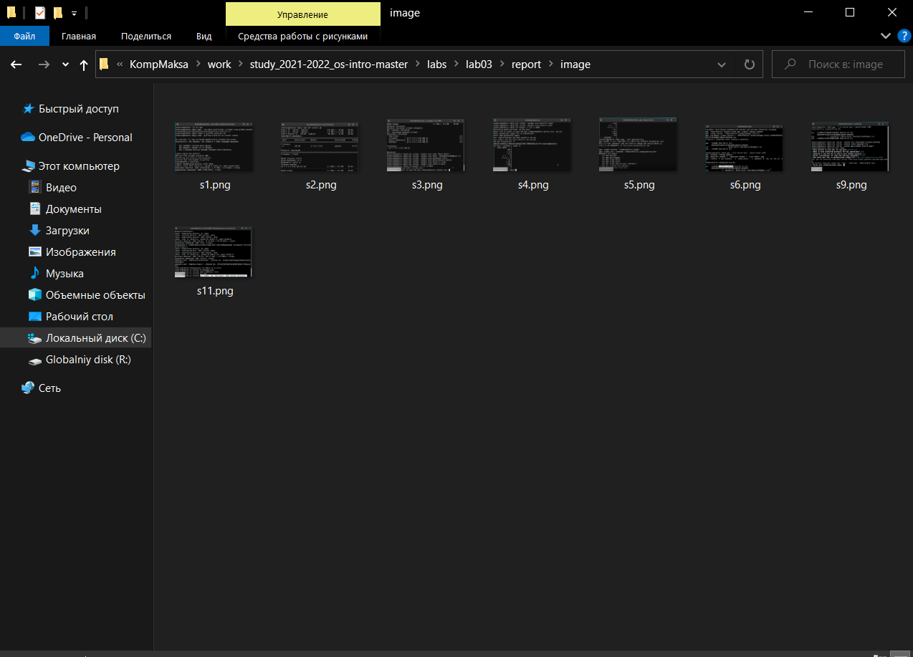
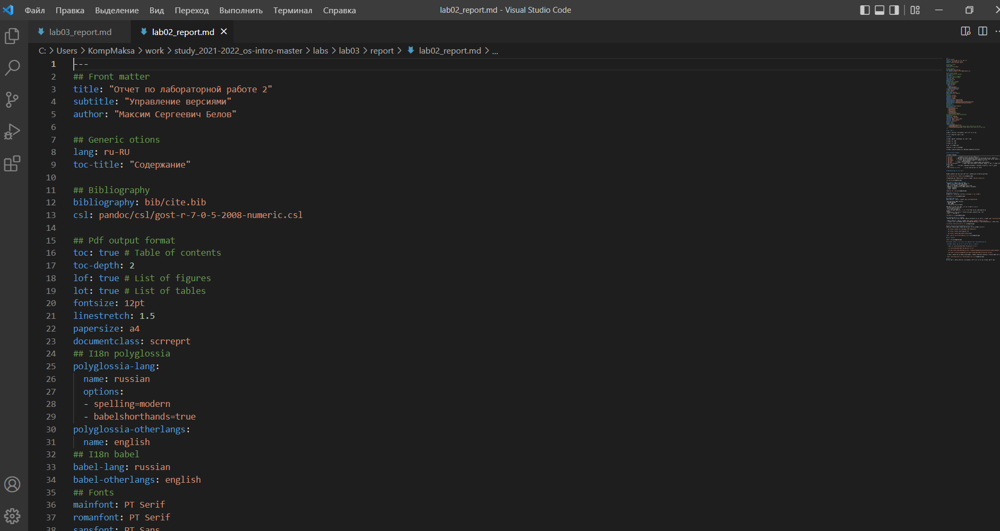
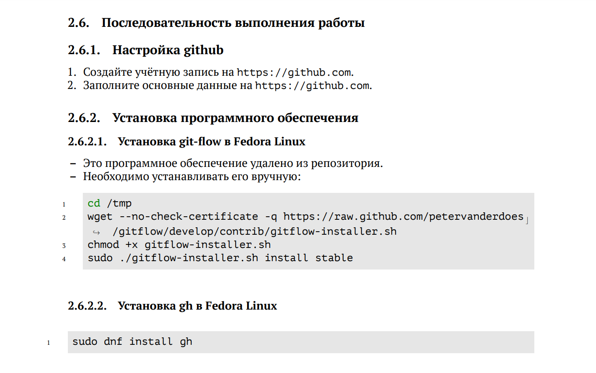
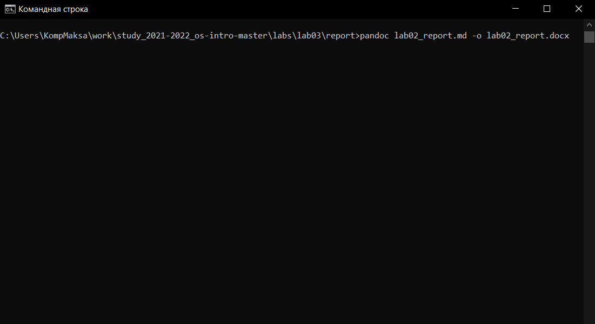

---
## Front matter
lang: ru-RU
title: Лабораторная работа №3
author: |
Maxim S. Belov
date: 28.04.2022
## Formatting
toc: false
slide_level: 2
theme: metropolis
header-includes: 
 - \metroset{progressbar=frametitle,sectionpage=progressbar,numbering=fraction}
 - '\makeatletter'
 - '\beamer@ignorenonframefalse'
 - '\makeatother'
aspectratio: 43
section-titles: true
---

# **Markdown**

## Цель работы 

Научиться оформлять отчёты с помощью легковесного языка разметки Markdown.

## Задание
Сделать отчёт по предыдущей лабораторной работе в формате Markdown.

## **Выполнение лабораторной работы**

- **Скриншоты**

Сделаем скриншоты выполнения лабораторной работы 3 и поместим их в папку imagelab3 в папке отчета:

-  **Файл отчета по ЛР2**

Создадим markdown файл и скопируем в него шаблон отчета:

- **Написание отчета по ЛР2**

Откроем инструкцию по ЛР2 и будем пошагово писать отчет, прикрепляя скриншоты

- **Конвертация отчета из markdown**:
С помощью программы pandoc сконвертируем наш отчет по ЛР2 в docx.

## Выводы

В ходе работы я научился оформлять отчёты с помощью легковесного языка разметки Markdown. Также в процессе выполнения работы возникли трудности с преобразованием md файла в pdf.

