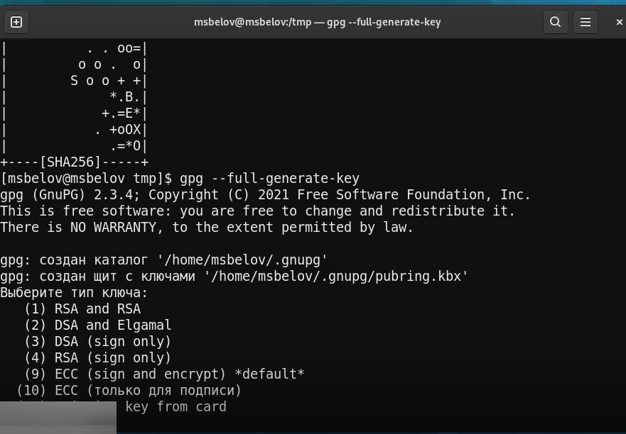
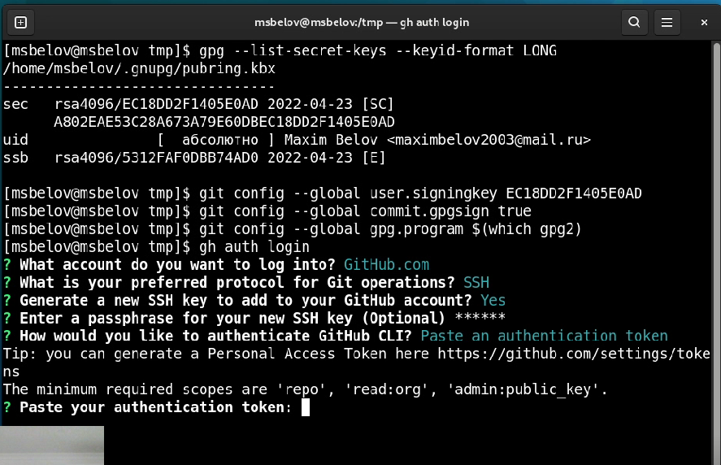

---
## Front matter
title: "Отчет по лабораторной работе 2"
subtitle: "Управление версиями"
author: "Максим Сергеевич Белов"

## Generic otions
lang: ru-RU
toc-title: "Содержание"

## Bibliography
bibliography: bib/cite.bib
csl: pandoc/csl/gost-r-7-0-5-2008-numeric.csl

## Pdf output format
toc: true # Table of contents
toc-depth: 2
lof: true # List of figures
lot: true # List of tables
fontsize: 12pt
linestretch: 1.5
papersize: a4
documentclass: scrreprt
## I18n polyglossia
polyglossia-lang:
  name: russian
  options:
	- spelling=modern
	- babelshorthands=true
polyglossia-otherlangs:
  name: english
## I18n babel
babel-lang: russian
babel-otherlangs: english
## Fonts
mainfont: PT Serif
romanfont: PT Serif
sansfont: PT Sans
monofont: PT Mono
mainfontoptions: Ligatures=TeX
romanfontoptions: Ligatures=TeX
sansfontoptions: Ligatures=TeX,Scale=MatchLowercase
monofontoptions: Scale=MatchLowercase,Scale=0.9
## Biblatex
biblatex: true
biblio-style: "gost-numeric"
biblatexoptions:
  - parentracker=true
  - backend=biber
  - hyperref=auto
  - language=auto
  - autolang=other*
  - citestyle=gost-numeric
## Pandoc-crossref LaTeX customization
figureTitle: "Рис."
tableTitle: "Таблица"
listingTitle: "Листинг"
lofTitle: "Список иллюстраций"
lotTitle: "Список таблиц"
lolTitle: "Листинги"
## Misc options
indent: true
header-includes:
  - \usepackage{indentfirst}
  - \usepackage{float} # keep figures where there are in the text
  - \floatplacement{figure}{H} # keep figures where there are in the text
---

# Цель работы

– Изучить идеологию и применение средств контроля версий.

– Освоить умения по работе с git.

# Задание

– Создать базовую конфигурацию для работы с git.

– Создать ключ SSH.

– Создать ключ PGP.

– Настроить подписи git.

– Зарегистрироваться на Github.

– Создать локальный каталог для выполнения заданий по предмету.

# Теоретическое введение

| Команды| Описание                                                                                                           |
|--------------|----------------------------------------------------------------------------------------------------------------------------|
| `git init`          | Создание основного дерева репозитория                                                                               |
| `git pull`      | Получение обновлений (изменений) текущего дерева из центрального репозитория     |
| `git push`       | Отправка всех произведённых изменений локального дерева в центральный репозиторий программ                                           |
| `git status`      | Просмотр списка изменённых файлов в текущей директории |
| `git diff`     | Просмотр текущих изменений                                                                                   |
| `git add .`      | Добавить все изменённые и/или созданные файлы и/или каталоги                                                                                     |
| `git rm имена_файлов`       | Удалить файл и/или каталог из индекса репозитория (при этом файл и/или каталог остаётся в локальной директории)                                                                |
| `git commit`       | Сохранить добавленные изменения с внесением комментария через встроенный редактор                                                                                 |
| `git checkout имя_ветки`       | Переключение на некоторую ветку                                                                                 |

# Выполнение лабораторной работы

Аккаунт github у меня уже имелся поэтому я сразу перешёл к установке git-flow:

Устанавливаем gh в Fedora Linux с помощью команды `sudo dnf install gh`:

## Переходим к базовой настройке git:
- Зададим имя и email владельца репозитория
- Настроим utf-8 в выводе сообщений git
- Настроим верификацию и подписание коммитов git.
- Зададим имя начальной ветки (будем называть её master)
- Параметр autocrlf
- Параметр safecrlf

## Создание ssh ключа:
Создадим ключ ssh по алгоритму rsa (`ssh-keygen -t rsa -b 4096`)

## Создание gpg ключа:
Генерируем ключ с помощью команды `gpg --full-generate-key`

 Из предложенных опций выбираем:
- тип RSA and RSA;
- размер 4096;
- срок действия 0 (не истекает)

GPG запросит личную информацию, которая сохранится в ключе:
- Имя (не менее 5 символов).
- Адрес электронной почты.
- При вводе email убедитесь, что он соответствует адресу, используемому на
GitHub.
- Комментарий. Можно ввести что угодно или нажать клавишу ввода, чтобы
оставить это поле пустым

## Добавление GPG ключа в GitHub:
- Выводим список ключей и копируем отпечаток приватного ключа с помощью команды `gpg --list-secret-keys --keyid-format LONG`

- Генеририруем ключ с помощью команды `gpg --armor --export <Отпечаток ключа>`
- Перейдем в настройки GitHub, нажмем на кнопку New GPG key и вставим полученный ключ в поле ввода.

## Настройка автоматических подписей коммитов git:
Используя введёный email, укажем Git применять его при подписи коммитов:

- `git config --global user.signingkey <PGP Fingerprint>`

- `git config --global commit.gpgsign true`

- `git config --global gpg.program $(which gpg2)`

## Настройка gh:

## Сознание репозитория курса на основе шаблона и настройка каталога курса:

 **Создадим шаблон рабочего пространства с помощью команд:**

 - `mkdir -p ~/work/study/2021-2022/"Операционные системы"`

 - `cd ~/work/study/2021-2022/"Операционные системы"`

 - `gh repo create study_2021-2022_os-intro --template=yamadharma/course-directory-student-template --public`

 - `git clone --recursive git@github.com:<owner>/study_2021-2022_os-intro.git os-intro`

 Перейдем в каталог курса, удалим лишние файлы, создадим необходимые каталоги и отправим файлы на сервер:

 

# Выводы
В ходе работы я изучил идеологию и применение средств контроля версий, а также работу с git.

