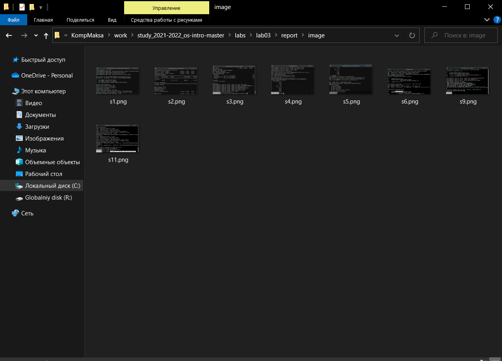
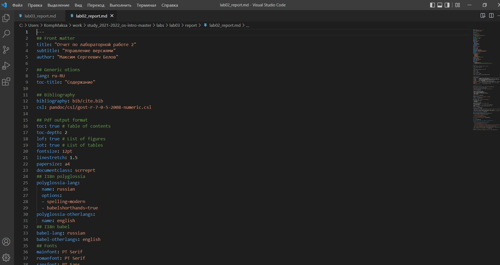
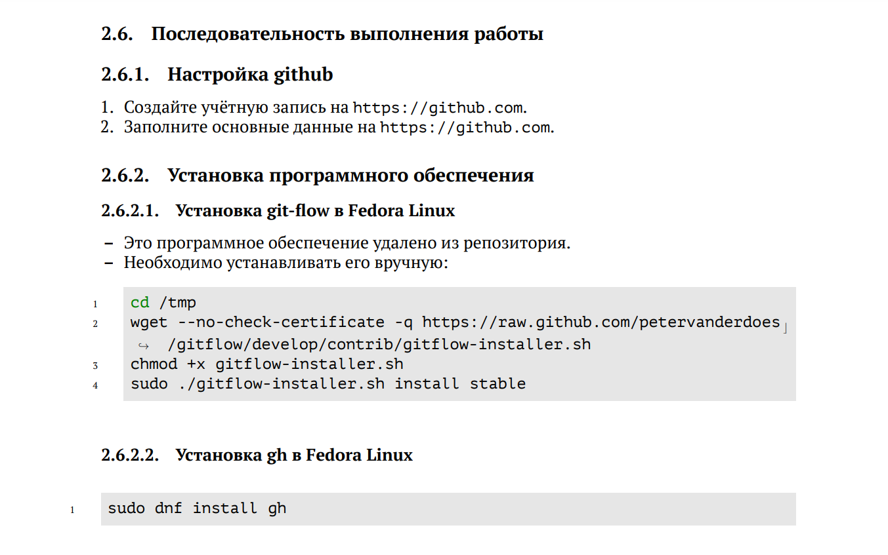
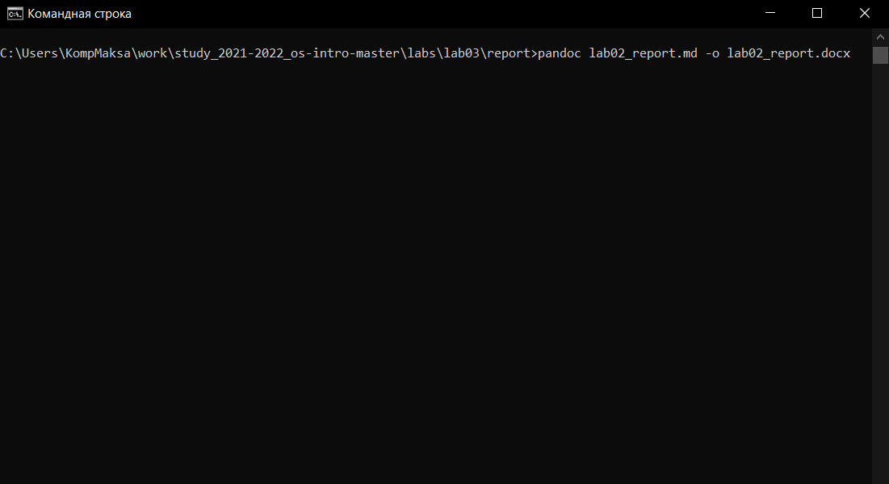

---
## Front matter
title: "Отчет по лабораторной работе 3"
subtitle: "Markdown"
author: "Максим Сергеевич Белов"

## Generic otions
lang: ru-RU
toc-title: "Содержание"

## Bibliography
bibliography: bib/cite.bib
csl: pandoc/csl/gost-r-7-0-5-2008-numeric.csl

## Pdf output format
toc: true # Table of contents
toc-depth: 2
lof: true # List of figures
lot: true # List of tables
fontsize: 12pt
linestretch: 1.5
papersize: a4
documentclass: scrreprt
## I18n polyglossia
polyglossia-lang:
  name: russian
  options:
	- spelling=modern
	- babelshorthands=true
polyglossia-otherlangs:
  name: english
## I18n babel
babel-lang: russian
babel-otherlangs: english
## Fonts
mainfont: PT Serif
romanfont: PT Serif
sansfont: PT Sans
monofont: PT Mono
mainfontoptions: Ligatures=TeX
romanfontoptions: Ligatures=TeX
sansfontoptions: Ligatures=TeX,Scale=MatchLowercase
monofontoptions: Scale=MatchLowercase,Scale=0.9
## Biblatex
biblatex: true
biblio-style: "gost-numeric"
biblatexoptions:
  - parentracker=true
  - backend=biber
  - hyperref=auto
  - language=auto
  - autolang=other*
  - citestyle=gost-numeric
## Pandoc-crossref LaTeX customization
figureTitle: "Рис."
tableTitle: "Таблица"
listingTitle: "Листинг"
lofTitle: "Список иллюстраций"
lotTitle: "Список таблиц"
lolTitle: "Листинги"
## Misc options
indent: true
header-includes:
  - \usepackage{indentfirst}
  - \usepackage{float} # keep figures where there are in the text
  - \floatplacement{figure}{H} # keep figures where there are in the text
---

# Цель работы

- Научиться оформлять отчёты с помощью легковесного языка разметки Markdown.

# Задание

- Сделать отчёт по предыдущей лабораторной работе в формате Markdown.

# Теоретическое введение

| Базовые сведения о markdown| Описание                                                                                                           |
|--------------|----------------------------------------------------------------------------------------------------------------------------|
| `# This is heading`          | Чтобы создать заголовок, используйте знак #                                                                               |
| `**bold**`      | Чтобы задать для текста полужирное начертание, заключите его в двойные звездочки    |
| `*text*`       | Чтобы задать для текста курсивное начертание, заключите его в одинарные звездочки программ                                           |
| `***text***`      |Чтобы задать для текста полужирное и курсивное начертание, заключите его в тройные звездочки |
| `>text`     | Блоки цитирования создаются с помощью символа >                                                                                   |
| `- text`      | Неупорядоченный (маркированный) список можно отформатировать с помощью звездочек или тире                                                                                     |
| `[link text](file-name.md)`       | Синтаксис Markdown для встроенной ссылки состоит из части [link text] , представляющей текст гиперссылки, и части (file-name.md) – URL-адреса или имени файла, на который дается ссылка                                                                |

# Выполнение лабораторной работы

## **Скриншоты**
Сделаем скриншоты выполнения лабораторной работы 3 и поместим их в папку imagelab3 в папке отчета:

## **Файл отчета по ЛР2**
Создадим markdown файл и скопируем в него шаблон отчета:

## **Написание отчета по ЛР2**
Откроем инструкцию по ЛР2 и будем пошагово писать отчет, прикрепляя скриншоты

## **Конвертация отчета из markdown**:
С помощью программы pandoc сконвертируем наш отчет по ЛР2 в docx.

# Выводы
В ходе работы я научился оформлять отчёты с помощью легковесного языка разметки Markdown. Также в процессе выполнения возникли трудности преобразования файла отчета из md в pdf.

