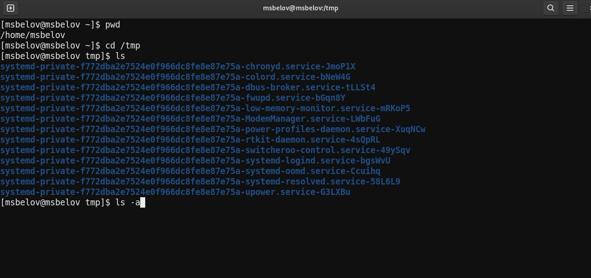
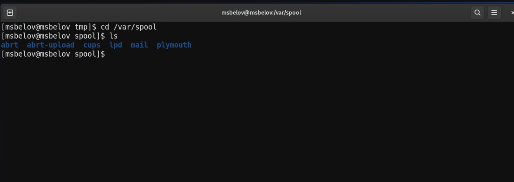
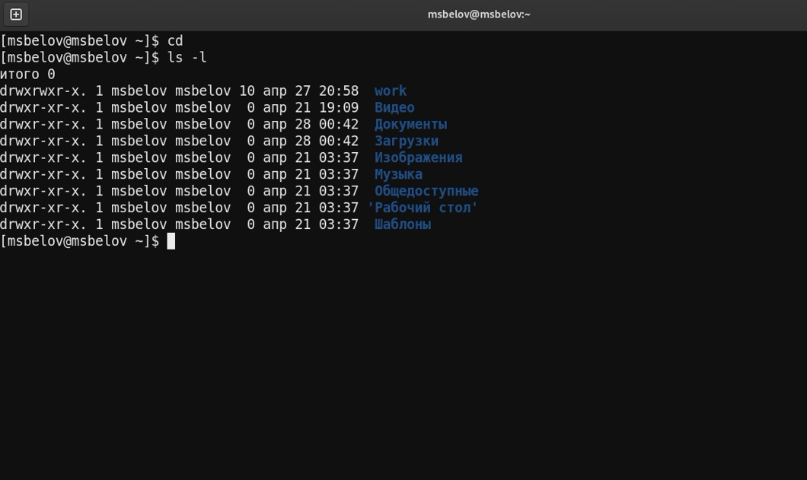
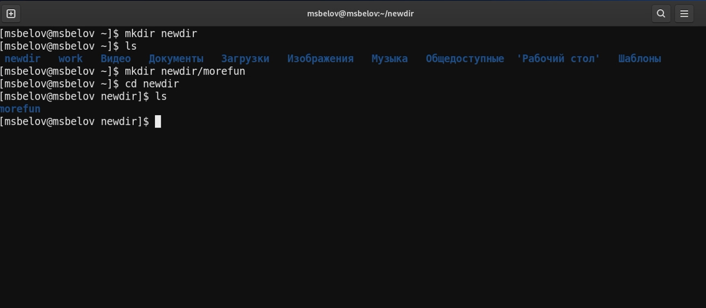
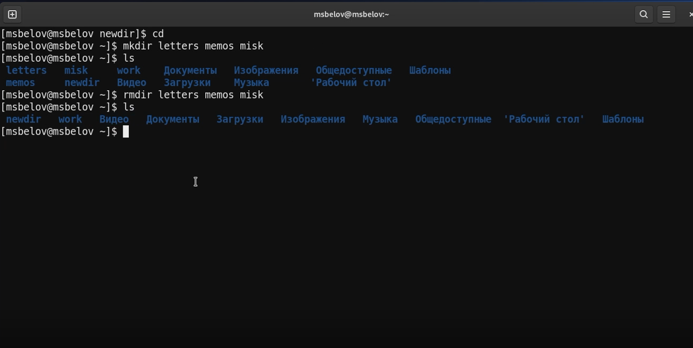
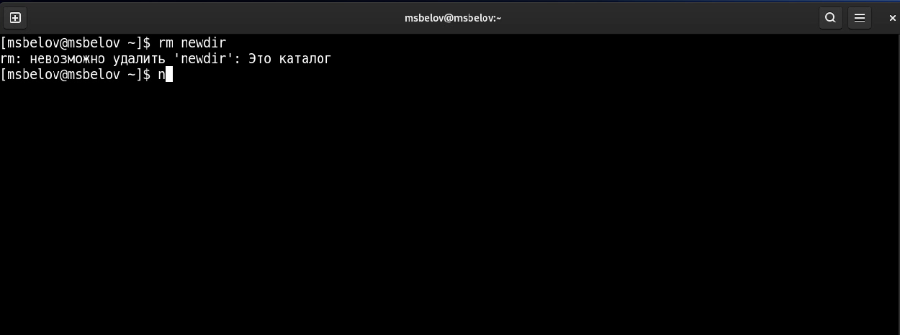
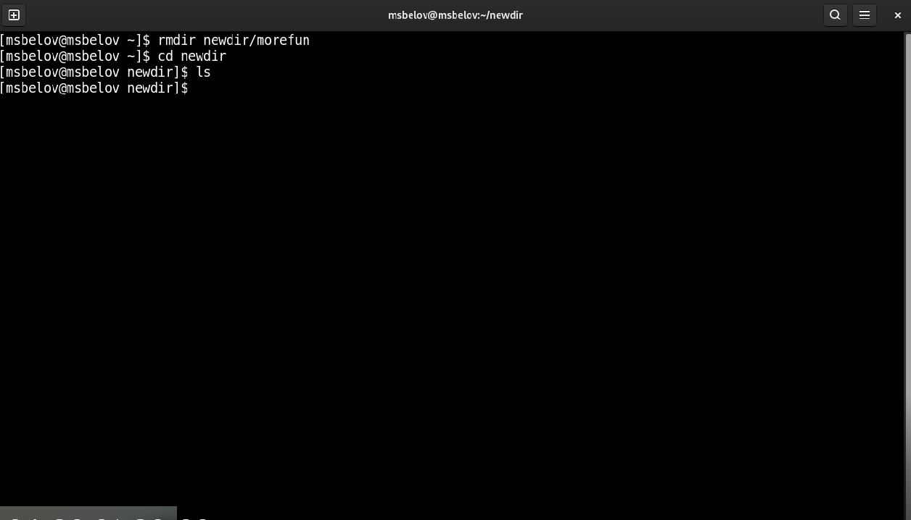
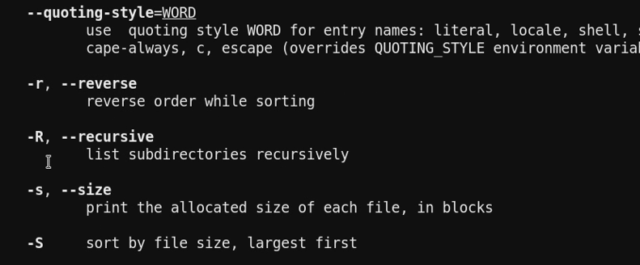
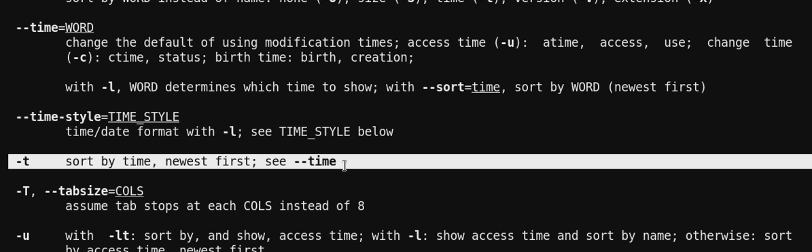
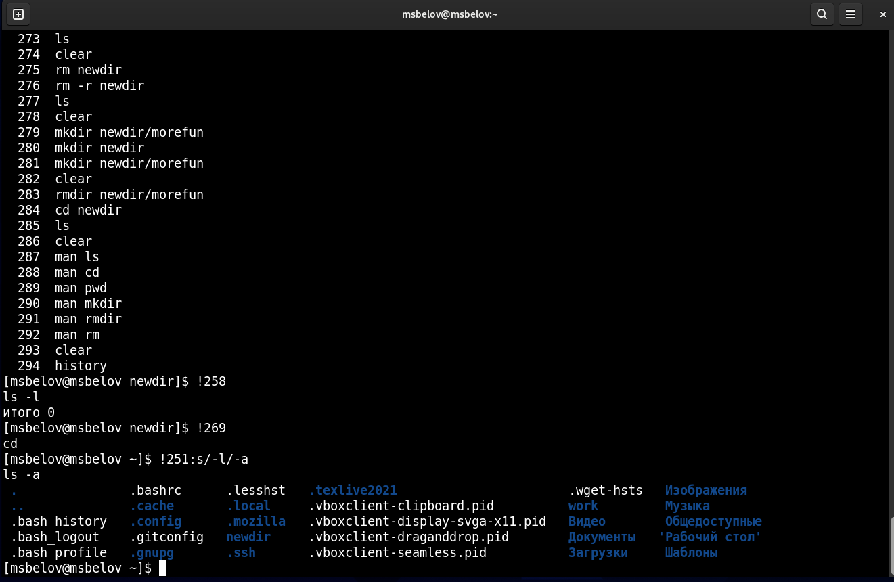

---
## Front matter
lang: ru-RU
title: Лабораторная работа №4
author: |
Maxim S. Belov
date: 30.04.2022

## Formatting
toc: false
slide_level: 2
theme: metropolis
header-includes: 
 - \metroset{progressbar=frametitle,sectionpage=progressbar,numbering=fraction}
 - '\makeatletter'
 - '\beamer@ignorenonframefalse'
 - '\makeatother'
aspectratio: 43
section-titles: true
---

# Основы интерфейса взаимодействия пользователя с системой Unix на уровне командной строки 
# Белов Максим Сергеевич

## Цель работы

Приобретение практических навыков взаимодействия пользователя с системой посредством командной строки.

## Задание

С помощью различных команд взаимодействовать с систмой.

## Выполнение лабораторной работы

Определим полное имя нашего домашнего каталога с помощью команды pwd. Перейдите в каталог /tmp и вывести его содержимое командой ls с различными опциями.

 Определим, есть ли в каталоге /var/spool подкаталог с именем cron (такого каталога не оказалось)

Перейдем в наш домашний каталог и выведем на экран его содержимое. Определим, кто является владельцем файлов и подкаталогов (владельцем являюсь я: msbelov) 

В домашнем каталоге создайте новый каталог с именем newdir и в нем создадим каталог morefun 

В домашнем каталоге создадим одной командой три новых каталога с именами
letters, memos, misk. Затем удалии эти каталоги одной командой. 

Попробуем удалить ранее созданный каталог ~/newdir командой rm. Проверим,
был ли каталог удалён (каталог не был удален, т.к просто командой rm удалить каталог не получится) 

Удалим каталог ~/newdir/morefun из домашнего каталога. Проверим, был ли
каталог удалён.

С помощью команды man определим, какую опцию команды ls нужно использовать для просмотра содержимое не только указанного каталога, но и подкаталогов,
входящих в него. (Этой опцией оказалась -R --recursive)

С помощью команды man определим набор опций команды ls, позволяющий отсортировать по времени последнего изменения выводимый список содержимого каталога с развёрнутым описанием файлов. (Этой опцией оказалась -t)

Используя информацию, полученную при помощи команды history, выполним модификацию и исполнение нескольких команд из буфера команд. Исполним команды 258, 269 и модифицированную команду 251 (заменили ключ -l на -a) 

# Выводы

В ходе работы я приобрел практические навыки взаимодействия пользователя с системой посредством командной строки.
