---
## Front matter
title: "Лабораторная работа №4"
subtitle: "Основы интерфейса взаимодействия пользователя с системой Unix на уровне командной строки"
author: "Максим Сергеевич Белов"

## Generic otions
lang: ru-RU
toc-title: "Содержание"

## Bibliography
bibliography: bib/cite.bib
csl: pandoc/csl/gost-r-7-0-5-2008-numeric.csl

## Pdf output format
toc: true # Table of contents
toc-depth: 2
lof: true # List of figures
lot: true # List of tables
fontsize: 12pt
linestretch: 1.5
papersize: a4
documentclass: scrreprt
## I18n polyglossia
polyglossia-lang:
  name: russian
  options:
	- spelling=modern
	- babelshorthands=true
polyglossia-otherlangs:
  name: english
## I18n babel
babel-lang: russian
babel-otherlangs: english
## Fonts
mainfont: PT Serif
romanfont: PT Serif
sansfont: PT Sans
monofont: PT Mono
mainfontoptions: Ligatures=TeX
romanfontoptions: Ligatures=TeX
sansfontoptions: Ligatures=TeX,Scale=MatchLowercase
monofontoptions: Scale=MatchLowercase,Scale=0.9
## Biblatex
biblatex: true
biblio-style: "gost-numeric"
biblatexoptions:
  - parentracker=true
  - backend=biber
  - hyperref=auto
  - language=auto
  - autolang=other*
  - citestyle=gost-numeric
## Pandoc-crossref LaTeX customization
figureTitle: "Рис."
tableTitle: "Таблица"
listingTitle: "Листинг"
lofTitle: "Список иллюстраций"
lotTitle: "Список таблиц"
lolTitle: "Листинги"
## Misc options
indent: true
header-includes:
  - \usepackage{indentfirst}
  - \usepackage{float} # keep figures where there are in the text
  - \floatplacement{figure}{H} # keep figures where there are in the text
---

# Цель работы

Приобретение практических навыков взаимодействия пользователя с системой посредством командной строки.

# Задание

1. Определите полное имя вашего домашнего каталога. Далее относительно этого каталога будут выполняться последующие упражнения.
2. Выполните следующие действия:
- Перейдите в каталог /tmp.
- Выведите на экран содержимое каталога /tmp. Для этого используйте команду ls
с различными опциями. Поясните разницу в выводимой на экран информации.
- Определите, есть ли в каталоге /var/spool подкаталог с именем cron?
- Перейдите в Ваш домашний каталог и выведите на экран его содержимое. Определите, кто является владельцем файлов и подкаталогов?
3. Выполните следующие действия:
- В домашнем каталоге создайте новый каталог с именем newdir.
- В каталоге ~/newdir создайте новый каталог с именем morefun.
- В домашнем каталоге создайте одной командой три новых каталога с именами
letters, memos, misk. Затем удалите эти каталоги одной командой.
- Попробуйте удалить ранее созданный каталог ~/newdir командой rm. Проверьте,
был ли каталог удалён.
- Удалите каталог ~/newdir/morefun из домашнего каталога. Проверьте, был ли
каталог удалён.
4. С помощью команды man определите, какую опцию команды ls нужно использовать для просмотра содержимое не только указанного каталога, но и подкаталогов,
входящих в него.
5. С помощью команды man определите набор опций команды ls, позволяющий отсортировать по времени последнего изменения выводимый список содержимого каталога
с развёрнутым описанием файлов.
6. Используйте команду man для просмотра описания следующих команд: cd, pwd, mkdir,
rmdir, rm. Поясните основные опции этих команд.
7. Используя информацию, полученную при помощи команды history, выполните модификацию и исполнение нескольких команд из буфера команд.

# Теоретическое введение

| Команд | Описание команд                                                                                                          |
|--------------|----------------------------------------------------------------------------------------------------------------------------|
| `man`          | Команда man используется для просмотра (оперативная помощь) в диалоговом режиме руководства (manual) по основным командам операционной системы типа Linux.                                                                               |
| `cd`      | Команда cd используется для перемещения по файловой системе операционной системы типа Linux.    |
| `pwd`       | Для определения абсолютного пути к текущему каталогу используется команда pwd (print working directory)                                           |
| `ls`      | Команда ls используется для просмотра содержимого каталога. |
| `mkdir`     | Команда mkdir используется для создания каталогов                                                                                   |
| `rm`      | Команда rm используется для удаления файлов и/или каталогов.                                                                                     |
| `history`       |Для вывода на экран списка ранее выполненных команд используется команда history. Выводимые на экран команды в списке нумеруются. К любой команде из выведенного на экран списка можно обратиться по её номеру в списке, воспользовавшись конструкцией !<номер_команды>. 

# Выполнение лабораторной работы

Определим полное имя нашего домашнего каталога с помощью команды pwd. Перейдите в каталог /tmp и вывести его содержимое командой ls с различными опциями.(Рис. 1)

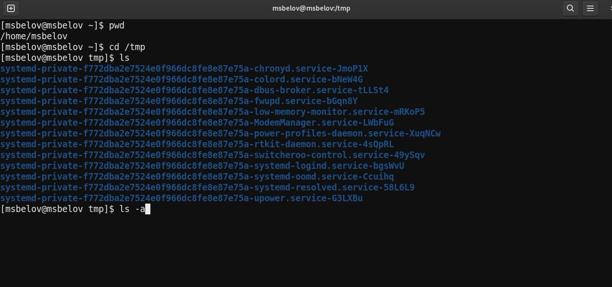{ #fig:001 width=70% }

 Определим, есть ли в каталоге /var/spool подкаталог с именем cron (такого каталога не оказалось) (Рис. 2)

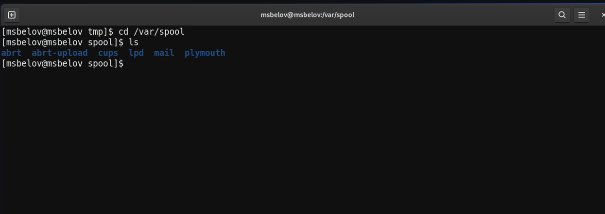{ #fig:002 width=70% }

Перейдем в наш домашний каталог и выведем на экран его содержимое. Определим, кто является владельцем файлов и подкаталогов (владельцем являюсь я: msbelov) (Рис. 3)

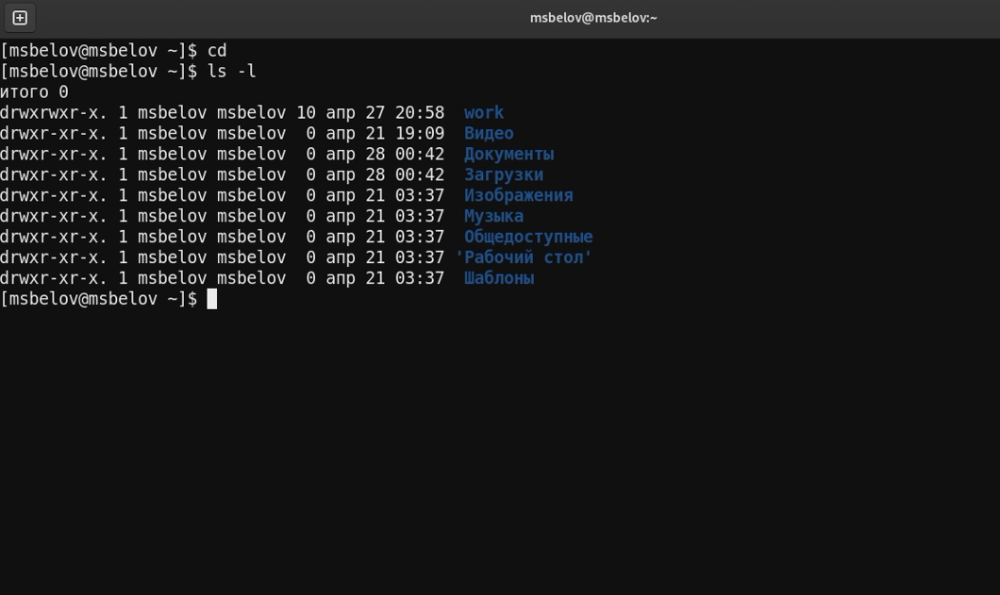{ #fig:003 width=70% }

В домашнем каталоге создайте новый каталог с именем newdir и в нем создадим каталог morefun (Рис. 4)

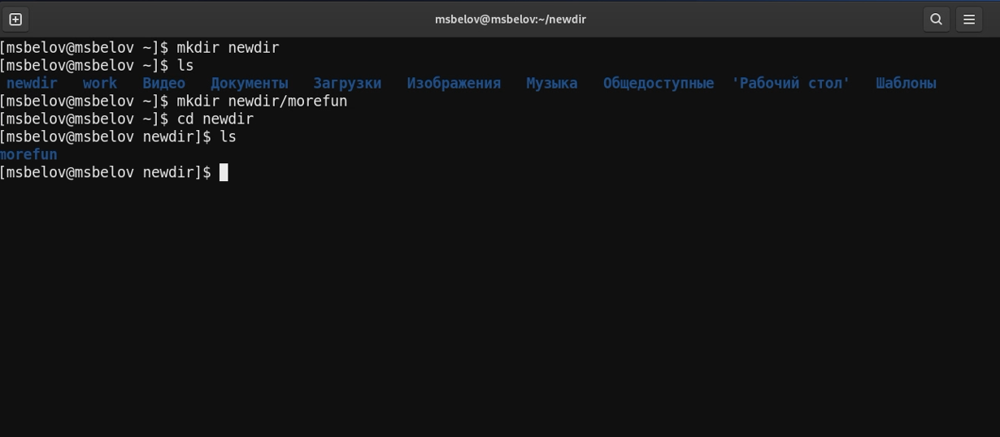{ #fig:004 width=70% }

В домашнем каталоге создадим одной командой три новых каталога с именами
letters, memos, misk. Затем удалии эти каталоги одной командой. (Рис. 5)

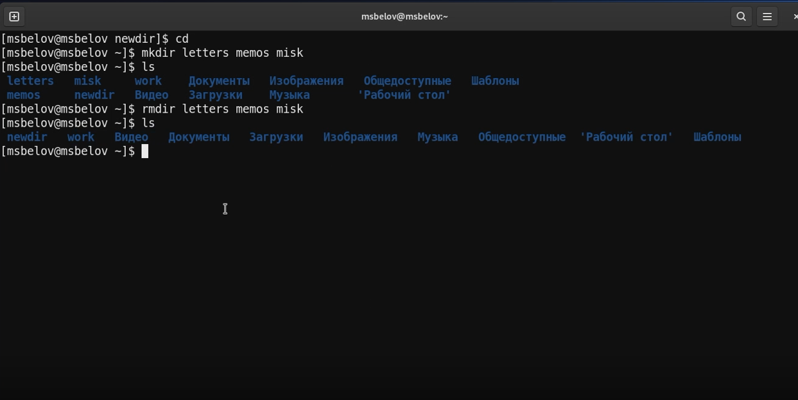{ #fig:005 width=70% }

Попробуем удалить ранее созданный каталог ~/newdir командой rm. Проверим,
был ли каталог удалён (каталог не был удален, т.к просто командой rm удалить каталог не получится) (Рис. 6)

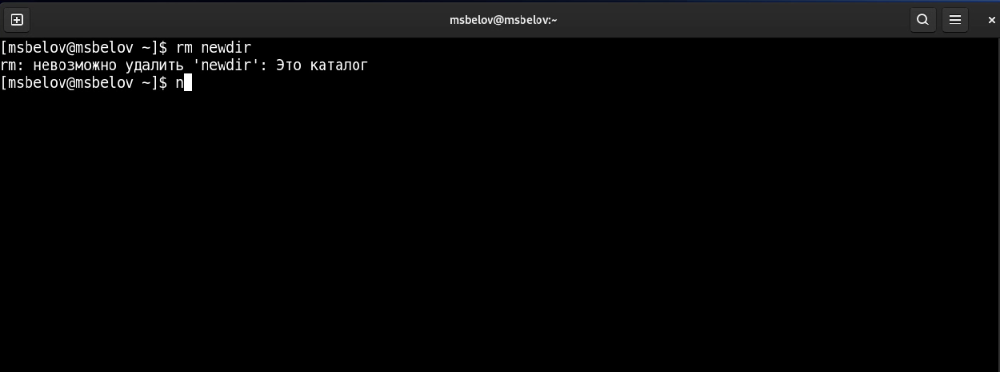{ #fig:006 width=70% }

Удалим каталог ~/newdir/morefun из домашнего каталога. Проверим, был ли
каталог удалён. (Рис. 7)

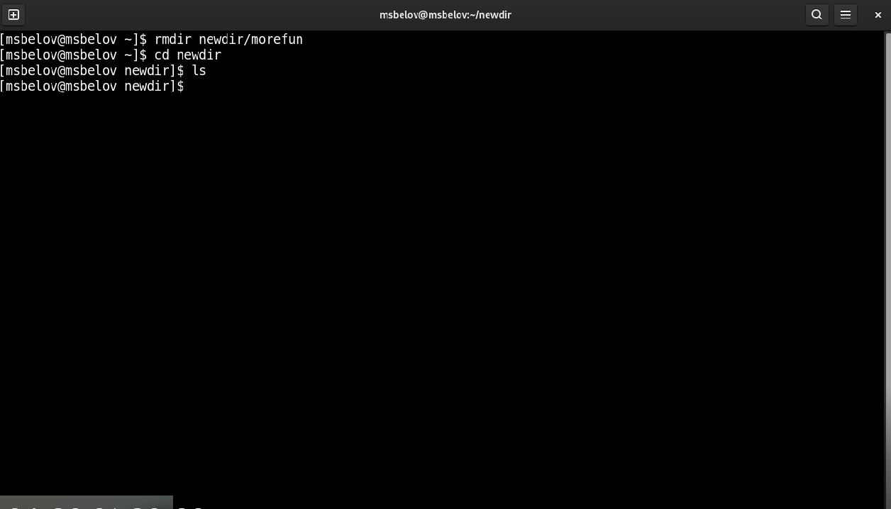{ #fig:007 width=70% }

С помощью команды man определим, какую опцию команды ls нужно использовать для просмотра содержимое не только указанного каталога, но и подкаталогов,
входящих в него. (Этой опцией оказалась -R --recursive) (Рис. 8)

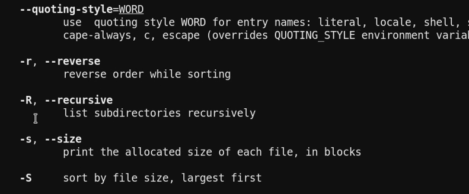{ #fig:008 width=70% }

С помощью команды man определим набор опций команды ls, позволяющий отсортировать по времени последнего изменения выводимый список содержимого каталога с развёрнутым описанием файлов. (Этой опцией оказалась -t) (Рис. 9)

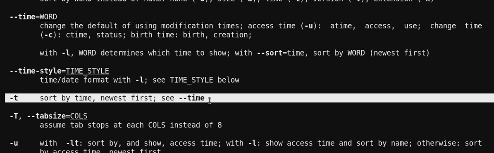{ #fig:009 width=70% }

Используем команду man для просмотра описания следующих команд: cd, pwd, mkdir, rmdir, rm (Рис. 10)

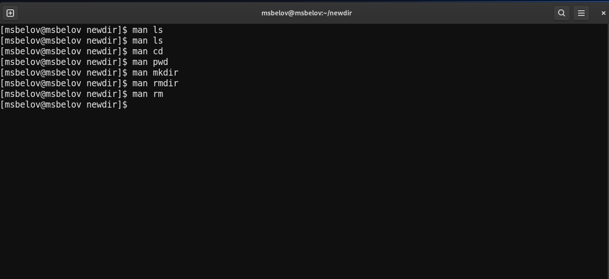{ #fig:010 width=70% }

Используя информацию, полученную при помощи команды history, выполним модификацию и исполнение нескольких команд из буфера команд. Исполним команды 258, 269 и модифицированную команду 251 (заменили ключ -l на -a) (Рис. 11)

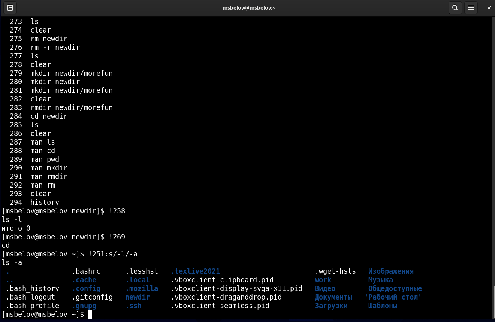{ #fig:011 width=70% }

# Выводы

В ходе работы я приобрел практические навыки взаимодействия пользователя с системой посредством командной строки.

# Контрольные вопросы

1. Что такое командная строка?

Ответ: Командная строка (консоль или Терминал) – это специальная программа, которая позволяет управлять компьютером путем ввода текстовых команд с клавиатуры.

2. При помощи какой команды можно определить абсолютный путь текущего каталога? Приведите пример.

Ответ: При помощи команды pwd можно определить абсолютный путь текущего каталога.

3. При помощи какой команды и каких опций можно определить только тип файлов и их имена в текущем каталоге? Приведите примеры.

Ответ: При помощи команды ls -F можно определить только тип файлов и их имена в текущем каталоге.

4. Какие файлы считаются скрытыми? Как получить информацию о скрытых файлах? Приведите примеры.

Ответ: Файл считается скрытым, если его название начинается с символа точка «.». Например, «.myfile». Обычно такие файлы используются приложениями для хранения настроек, конфигураций и другой информации, которую нужно скрыть от пользователя. Чтобы просмотреть скрытые файлы в каталоге необходимо ввести команду ls -a 

5. При помощи каких команд можно удалить файл и каталог? Можно ли это сделать одной и той же командой? Приведите примеры. 

Ответ: При помощи команд rm и rmdir можно удалить файл и каталог. Это нельзя сделать одной и той же командой. rmdir используется, чтобы удалить пустой каталог. rm используется, чтобы удалить непустые файлы или целые деревья каталогов.

6. Как определить, какие команды выполнил пользователь в сеансе работы?

Ответ: При помощи команды history.

7. Каким образом можно исправить и запустить на выполнение команду, которую пользователь уже использовал в сеансе работы? Приведите примеры.

Ответ: С помощью следующей команды: !<номер_команды>:s/<что_меняем>/<на_что_меняем>

8. Можно ли в одной строке записать несколько команд? Если да, то как? 
Приведите примеры 

Ответ: В одной строке можно записать несколько команд. Если требуется выполнить последовательно несколько команд, записанный в одной строке, то для этого используется символ точка с запятой. Пример: cd; ls.

9. Что такое символ экранирования? Приведите примеры использования этого символа.

Ответ: Экранирующий символ сообщает интерпретатору, что следующий за ним символ должен восприниматься как обычный символ. Пример: echo "Привет" # Привет echo "Он сказал: "Привет"." # Он сказал: "Привет".

10. Какая информация выводится на экран о файлах и каталогах, если используется опция l в команде ls?

Ответ: Если используется опция l в команде ls, то на экран выводится подробный список, в котором будет отображаться владелец, группа, дата создания, размер и другая информация о файлах и каталогах.

11. Что такое относительный путь к файлу? Приведите примеры использования относительного и абсолютного пути при выполнении какой-либо команды.

Ответ: Относительный путь – это путь к файлу относительно текущей папки. При использовании команды pwd на экран выведется абсолютный путь текущей директории. Пример: ~ = /home/msbelov. Первое относительный, второе абсолютный

12. Как получить информацию об интересующей вас команде?

Ответ: С помощью команды man.

13. Какая клавиша или комбинация клавиш служит для автоматического дополнения вводимых команд.

Ответ: Клавиша "Tab".