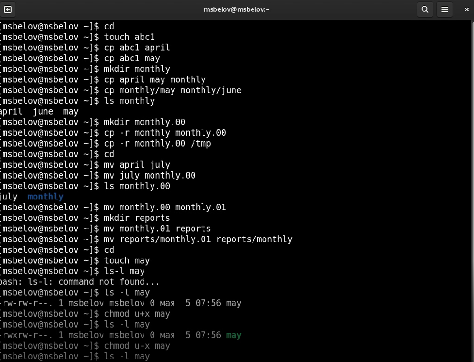
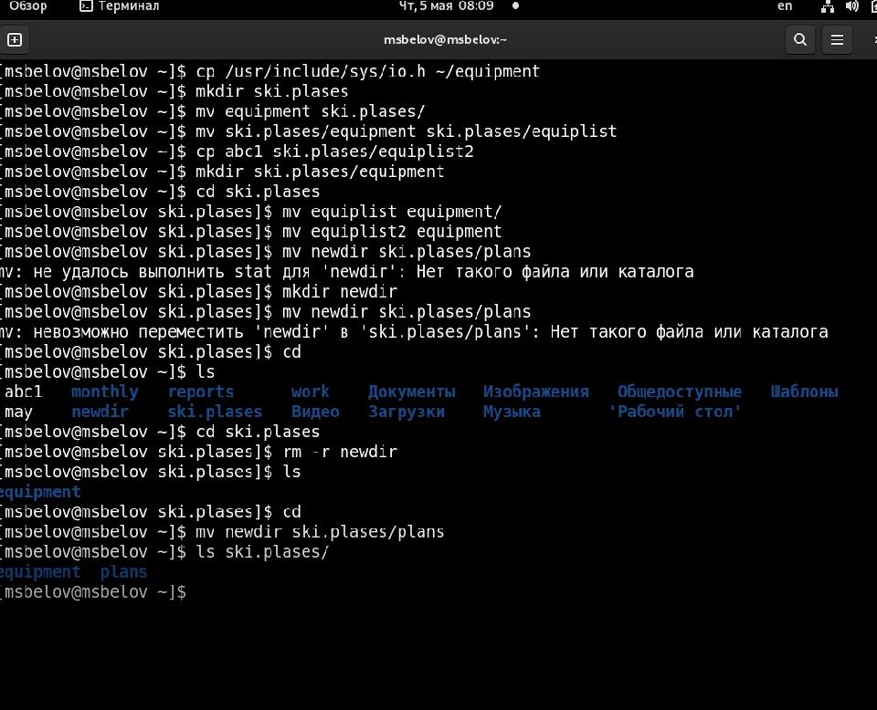
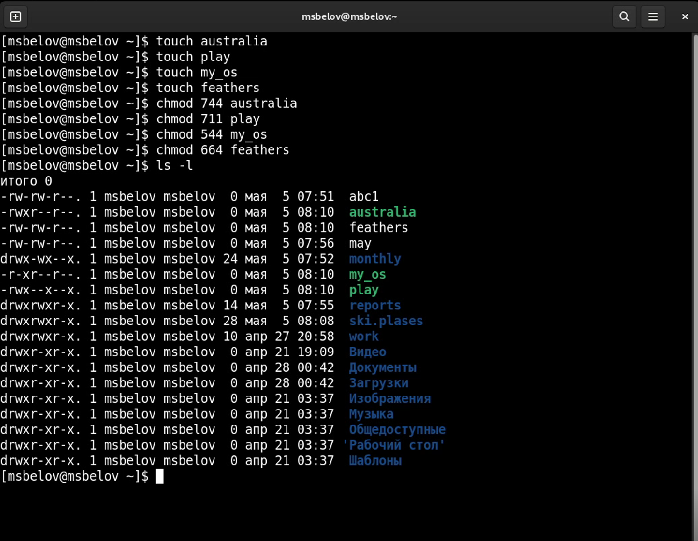
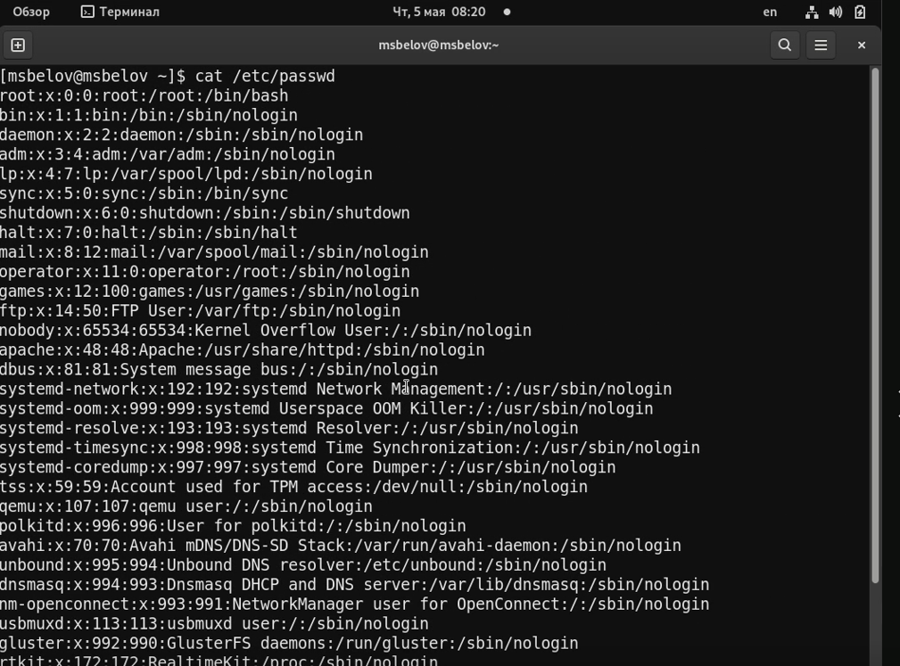
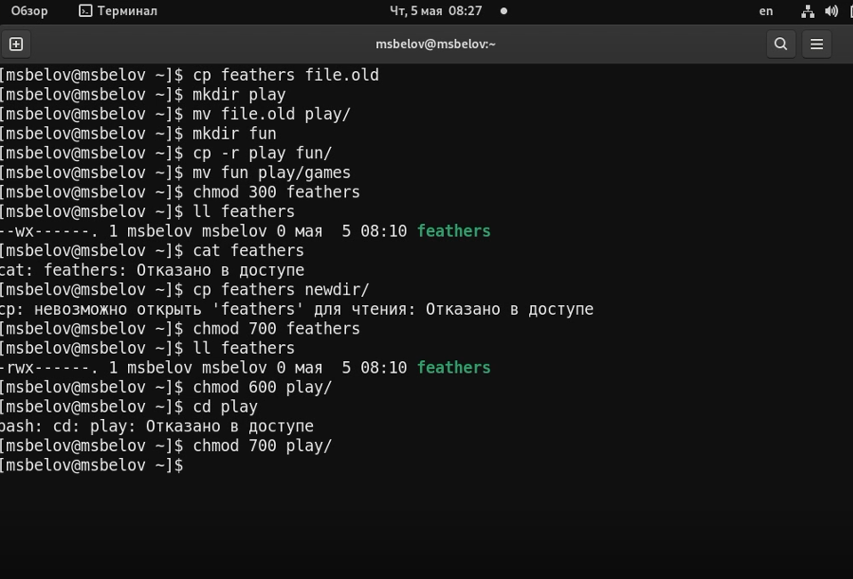
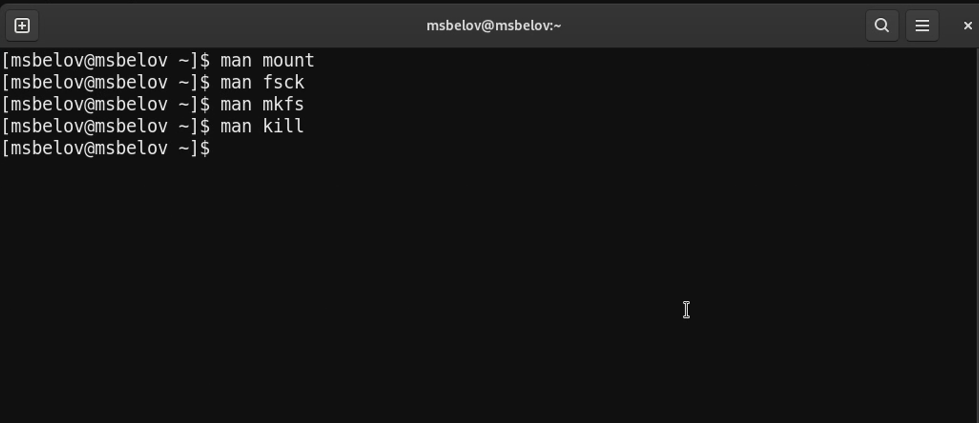

---
## Front matter
lang: ru-RU
title: Лабораторная работа №5
author: |
	Белов Максим Сергеевич - НПИбд-01-21
date: 05.05.2022

## Formatting
toc: false
slide_level: 2
theme: metropolis
header-includes: 
 - \metroset{progressbar=frametitle,sectionpage=progressbar,numbering=fraction}
 - '\makeatletter'
 - '\beamer@ignorenonframefalse'
 - '\makeatother'
aspectratio: 43
section-titles: true
---

# Анализ файловой системы Linux. Команды для работы с файлами и каталогами

## Цель работы:

Ознакомление с файловой системой Linux, её структурой, именами и содержанием
каталогов. Приобретение практических навыков по применению команд для работы
с файлами и каталогами, по управлению процессами (и работами), по проверке использования диска и обслуживанию файловой системы.

# Выполнение заданий

1. 1-й пункт:

 Выполните все примеры, приведённые в первой части описания лабораторной работы.

##

 2. 2-й пункт:

##

 3. 3-й пункт:

##

 4. 4-й пункт

##

##

5. 5-й пункт

- Прочитайте man по командам mount, fsck, mkfs, kill и кратко их охарактеризуйте, приведя примеры.

# Выводы

В ходе работы я ознакомился с файловой системой Linux, её структурой, именами и содержанием каталогов. Приобретел практические навыки по применению команд для работы с файлами и каталогами, по управлению процессами (и работами), по проверке использования диска и обслуживанию файловой системы.