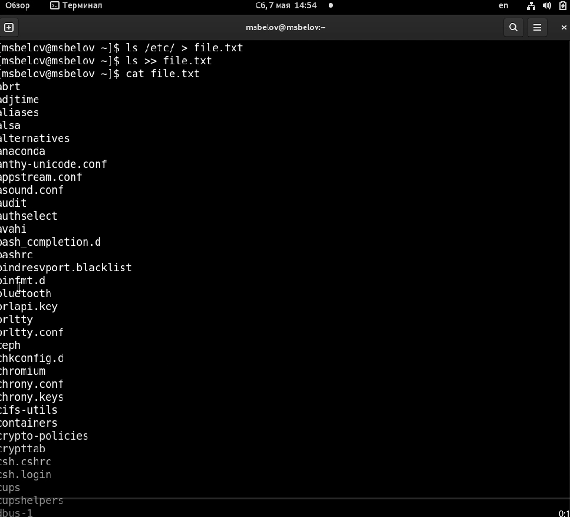
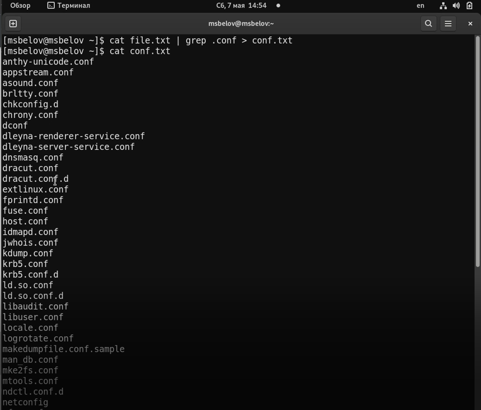
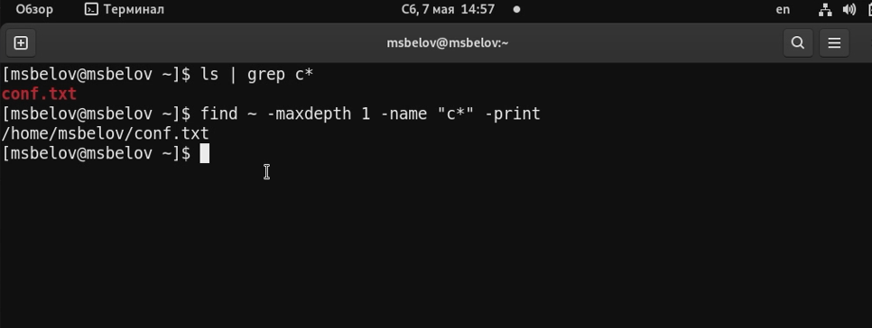
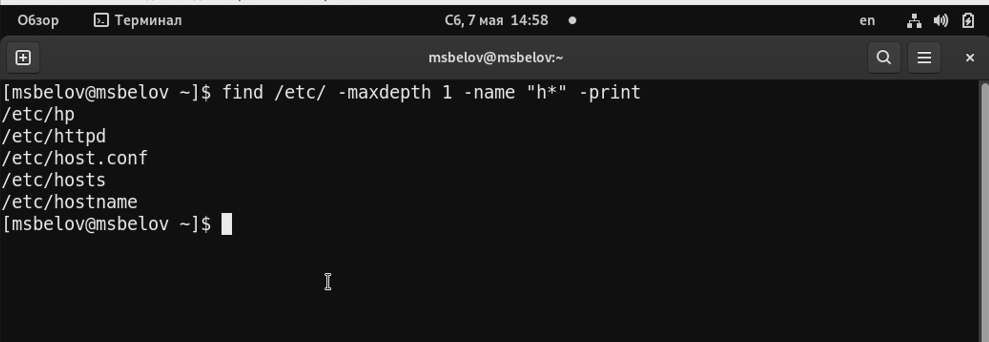
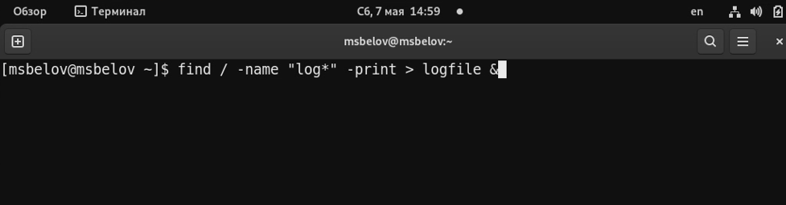
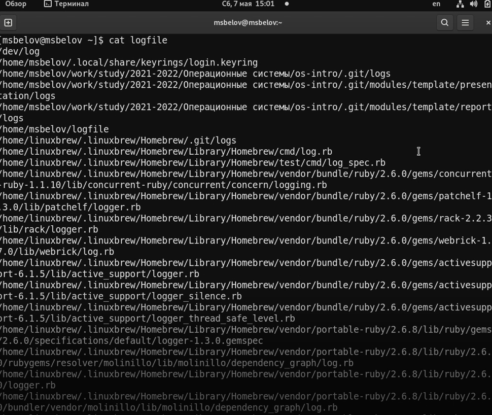
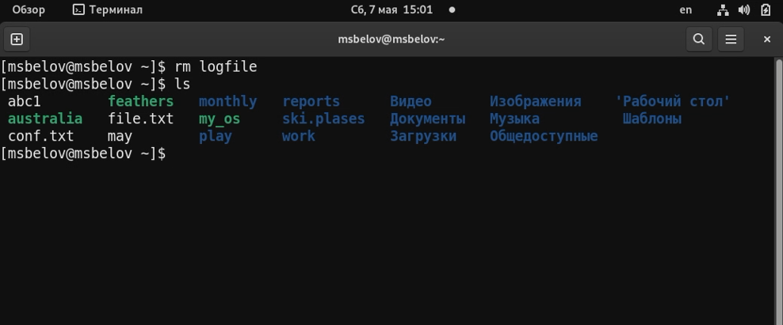
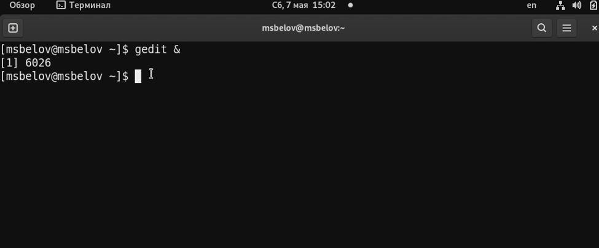
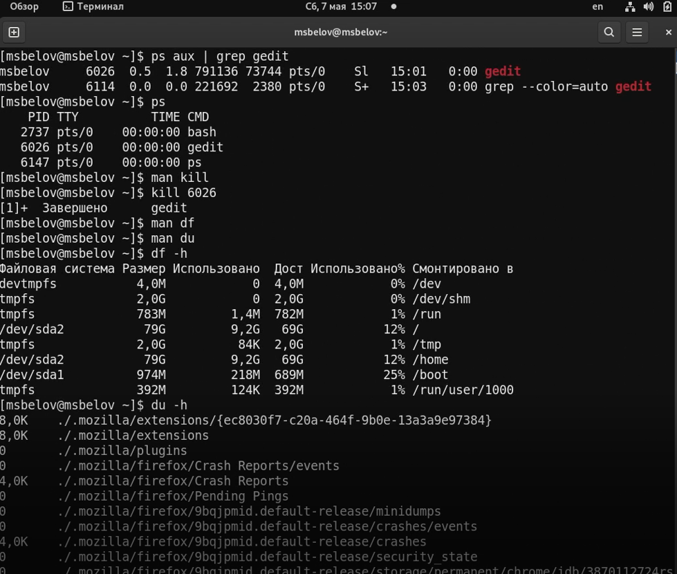
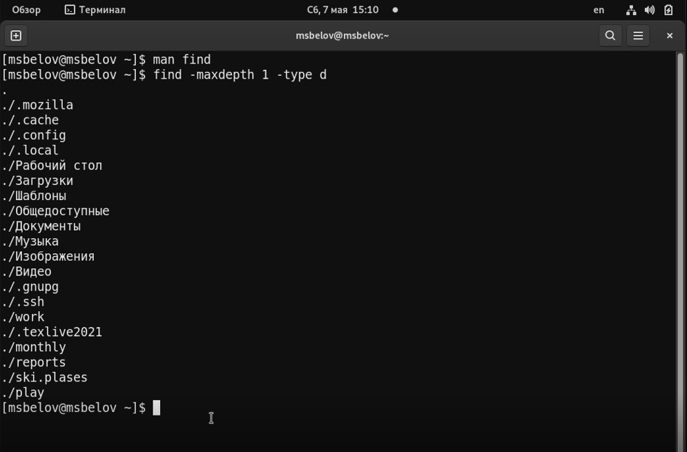

---
## Front matter
lang: ru-RU
title: Лабораторная работа №6
author: |
	Белов Максим Сергеевич - НПИбд-01-21
date: 05.05.2022

## Formatting
toc: false
slide_level: 2
theme: metropolis
header-includes: 
 - \metroset{progressbar=frametitle,sectionpage=progressbar,numbering=fraction}
 - '\makeatletter'
 - '\beamer@ignorenonframefalse'
 - '\makeatother'
aspectratio: 43
section-titles: true
---

# Поиск файлов. Перенаправление ввода-вывода. Просмотр запущенных процессов

## Цель работы:

Ознакомление с инструментами поиска файлов и фильтрации текстовых данных.
Приобретение практических навыков: по управлению процессами (и заданиями), по проверке использования диска и обслуживанию файловых систем.

# Выполнение заданий

1. Запишем в файл file.txt названия файлов, содержащихся в каталоге /etc. Допишем в этот же файл названия файлов, содержащихся в вашем домашнем каталоге.

##

 2. Выведем имена всех файлов из file.txt, имеющих расширение .conf, после чего запишем их в новый текстовой файл conf.txt.

##

 3. Определим, какие файлы в вашем домашнем каталоге имеют имена, начинавшиеся с символа c

##

 4. Выведим на экран (по странично) имена файлов из каталога /etc, начинающиеся с символа h с помощью команды find.

##

5. Запустим в фоновом режиме процесс, который будет записывать в файл ~/logfile файлы, имена которых начинаются с log.

##

6. Проверим наличия файлов начинающихся с log в logfile

##

7. Удалим файл ~/logfile.

##

8. Запустим из консоли в фоновом режиме редактор gedit используя знак "&"

##

9. Определим идентификатор процесса gedit. Используем kill для завершения процесса gedit. Выполним команды df и du,

##

10. Воспользовавшись справкой команды find, выведим имена всех директорий, имеющихся в вашем домашнем каталоге.

# Выводы

В ходе работы я ознакомился с инструментами поиска файлов и фильтрации текстовых данных. А также приобретел практические навыки: по управлению процессами (и заданиями), по проверке использования диска и обслуживанию файловых систем.