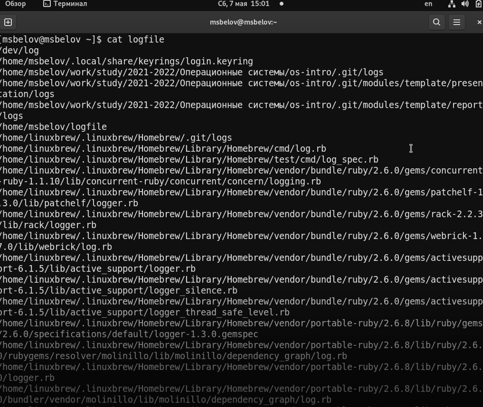

---
## Front matter
title: "Отчет по лабораторной работе №6"
subtitle: "Поиск файлов. Перенаправление ввода-вывода. Просмотр запущенных процессов"
author: "Максим Сергеевич Белов"

## Generic otions
lang: ru-RU
toc-title: "Содержание"

## Bibliography
bibliography: bib/cite.bib
csl: pandoc/csl/gost-r-7-0-5-2008-numeric.csl

## Pdf output format
toc: true # Table of contents
toc-depth: 2
lof: true # List of figures
lot: true # List of tables
fontsize: 12pt
linestretch: 1.5
papersize: a4
documentclass: scrreprt
## I18n polyglossia
polyglossia-lang:
  name: russian
  options:
	- spelling=modern
	- babelshorthands=true
polyglossia-otherlangs:
  name: english
## I18n babel
babel-lang: russian
babel-otherlangs: english
## Fonts
mainfont: PT Serif
romanfont: PT Serif
sansfont: PT Sans
monofont: PT Mono
mainfontoptions: Ligatures=TeX
romanfontoptions: Ligatures=TeX
sansfontoptions: Ligatures=TeX,Scale=MatchLowercase
monofontoptions: Scale=MatchLowercase,Scale=0.9
## Biblatex
biblatex: true
biblio-style: "gost-numeric"
biblatexoptions:
  - parentracker=true
  - backend=biber
  - hyperref=auto
  - language=auto
  - autolang=other*
  - citestyle=gost-numeric
## Pandoc-crossref LaTeX customization
figureTitle: "Рис."
tableTitle: "Таблица"
listingTitle: "Листинг"
lofTitle: "Список иллюстраций"
lolTitle: "Листинги"
## Misc options
indent: true
header-includes:
  - \usepackage{indentfirst}
  - \usepackage{float} # keep figures where there are in the text
  - \floatplacement{figure}{H} # keep figures where there are in the text
---

# Цель работы

Ознакомление с инструментами поиска файлов и фильтрации текстовых данных.
Приобретение практических навыков: по управлению процессами (и заданиями), по проверке использования диска и обслуживанию файловых систем.

# Задание

1. Осуществите вход в систему, используя соответствующее имя пользователя.
2. Запишите в файл file.txt названия файлов, содержащихся в каталоге /etc.Допишите в этот же файл названия файлов, содержащихся в вашем домашнем каталоге.
3. Выведите имена всех файлов из file.txt, имеющих расширение .conf, после чего запишите их в новый текстовой файл conf.txt.
4. Определите, какие файлы в вашем домашнем каталоге имеют имена, начинавшиеся с символа c? Предложите несколько вариантов, как это сделать.
5. Выведите на экран (по странично) имена файлов из каталога /etc, начинающиеся с символа h.
6. Запустите в фоновом режиме процесс, который будет записывать в файл ~/logfile файлы, имена которых начинаются с log.
7. Удалите файл ~/logfile.
8. Запустите из консоли в фоновом режиме редактор gedit.
9. Определите идентификатор процесса gedit, используя команду ps, конвейер и фильтр
grep. Как ещё можно определить идентификатор процесса?
10. Прочтите справку (man) команды kill, после чего используйте её для завершения процесса gedit.
11. Выполните команды df и du, предварительно получив более подробную информацию
об этих командах, с помощью команды man.
12. Воспользовавшись справкой команды find, выведите имена всех директорий, имеющихся в вашем домашнем каталоге.

# Теоретическое введение

В табл. [-@tbl:std-dir] приведено краткое описание команд по теме лабораторной работы.

: Описание некоторых команд по теме лабораторной {#tbl:std-dir}

| Команда | Описание команды                                                                                                          |
|--------------|----------------------------------------------------------------------------------------------------------------------------|
| `find`          | Команда find используется для поиска и отображения на экран имён файлов, соответствующих заданной строке символов.  touch.                                                                               |
| `grep `      | Найти в текстовом файле указанную строку символов позволяет команда grep.     |
| `df`       | ККоманда df показывает размер каждого смонтированного раздела диска.                                           |
| `du`      | Команда du показывает число килобайт, используемое каждым файлом или каталогом.   |

# Выполнение лабораторной работы

Запишем в файл file.txt названия файлов, содержащихся в каталоге /etc. Допишем в этот же файл названия файлов, содержащихся в вашем домашнем каталоге.
(Рис. [-@fig:001])

{ #fig:001 width=70% }

Выведем имена всех файлов из file.txt, имеющих расширение .conf, после чего запишем их в новый текстовой файл conf.txt.
(Рис. [-@fig:002])

{ #fig:002 width=70% }

Определим, какие файлы в вашем домашнем каталоге имеют имена, начинавшиеся с символа c? Предложим несколько вариантов, как это сделать. (С помощью команд ls и find)
(Рис. [-@fig:003])

{ #fig:003 width=70% }

Выведим на экран (по странично) имена файлов из каталога /etc, начинающиеся с символа h с помощью команды find.
(Рис. [-@fig:004])

{ #fig:004 width=70% }

Запустим в фоновом режиме процесс, который будет записывать в файл ~/logfile файлы, имена которых начинаются с log.
(Рис. [-@fig:005])

{ #fig:005 width=70% }

Проверим наличия файлов начинающихся с log в logfile (Рис. [-@fig:006])

{ #fig:006 width=70% }

Удалим файл ~/logfile. (Рис. [-@fig:007])

{ #fig:007 width=70% }

- Запустим из консоли в фоновом режиме редактор gedit используя знак "&".
(Рис. [-@fig:008])

{ #fig:008 width=70% }

- Определим идентификатор процесса gedit, используя команду ps, конвейер и фильтр grep.
- Прочтем справку (man) команды kill, после чего используем её для завершения процесса gedit.
- Выполним команды df и du, предварительно получив более подробную информацию
(Рис. [-@fig:009])

{ #fig:009 width=70% }

Воспользовавшись справкой команды find, выведим имена всех директорий, имеющихся в вашем домашнем каталоге. (Рис. [-@fig:010])

{ #fig:010 width=70% }

# Выводы

В ходе работы я ознакомился с инструментами поиска файлов и фильтрации текстовых данных. А также приобретел практические навыки: по управлению процессами (и заданиями), по проверке использования диска и обслуживанию файловых систем.

# Контрольные вопросы

1. Какие потоки ввода вывода вы знаете

 
- stdin — стандартный поток ввода (клавиатура),

- stdout — стандартный поток вывода (консоль),

- stderr — стандартный поток вывод сообщений об ошибках на экран

2. Объясните разницу между операцией > и >>.

 Символ > используется для переназначения стандартного ввода команды. Символ >> используется для присоединения данных в конец файла стандартного вывода команды(файл открывается в режиме добавления)

3. Что такое конвейер?

Конвейер - способ связи между двумя программами. Конвейер (pipe) служит для объединения простых команд или утилит в цепочки, в которых результат работы предыдущей команды передается последующей.

4. Что такое PID и GID?

Process ID(PID) - идентификатор порожденного процесса. Group ID (GID) - идентификация группы пользователей.

5. Что такое процесс? Чем это понятие отличается от программы??

Процесс - это программа, которая выполняется в отдельном виртуальном адресном пространстве. Когда пользователь регистрируется в системе, автоматически создается процесс, в котором выполняется оболочка (shell), например, /bin/bash. Компьютерная программа сама по себе — это только пассивная совокупность инструкций, в то время как процесс — это непосредственное выполнение этих инструкций.

6. Что такое задачи и какая команда позволяет ими управлять?

Запущенные фоном программы называются задачами (jobs). Ими можно управлять с помощью команды jobs, которая выводит список запущенных в данный момент задач. Для завершения задачи необходимо выполнить команду : kill %номер задачи

7. Найдите информацию об утилитах top и htop. Каковы их функции?

  top показывает объем занятой памяти вместе с кэш. htop выдает объём реально занятой памяти без кэша.

10. Как определить объем свободной памяти на жёстком диске? 

Кодмандой df

11. Как определить объем вашего домашнего каталога? 

Кодмандой du

12. Как удалить зависший процесс?

 kill PID
