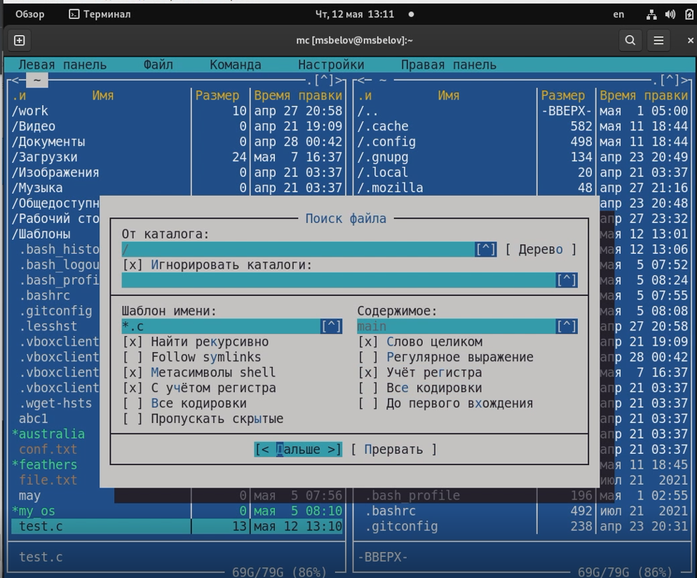

---
## Front matter
lang: ru-RU
title: Лабораторная работа №7
author: |
	Белов Максим Сергеевич - НПИбд-01-21
date: 12.05.2022

## Formatting
toc: false
slide_level: 2
theme: metropolis
header-includes: 
 - \metroset{progressbar=frametitle,sectionpage=progressbar,numbering=fraction}
 - '\makeatletter'
 - '\beamer@ignorenonframefalse'
 - '\makeatother'
aspectratio: 43
section-titles: true
---

# Командная оболочка Midnight Commander

## Цель работы:

Освоение основных возможностей командной оболочки Midnight Commander. Приобретение навыков практической работы по просмотру каталогов и файлов; манипуляций с ними.

# Выполнение заданий

1. Изучим информацию о mc, вызвав в командной строке man mc

##

 2. Запустии из командной строки mc, изучите его структуру и меню.

##

 3. Скопируем файл file.txt в каталог mc1

##

 4. Посмотрим права на какой-нибудь файл.

##

5. Выполним основные команды меню левой панели

##

6. Просмотр содержимого текстового файла

##

7. Поиск в файловой системе файла с заданными условиями (например, файла
с расширением .c или .cpp, содержащего строку main).

##

8.  Создайте текстовой файл text.txt. Откройте этот файл с помощью встроенного в mc редактора. Вставьте в открытый файл небольшой фрагмент текста, скопированный из любого другого файла или Интернета

##

9. Удалите строку текста (Ctrl+y). Выделите фрагмент текста и скопируйте его на новую строку (F3+F5). Выделите фрагмент текста и перенесите его на новую строку (F3+F6). Сохраните файл (F2). Отмените последнее действие. (Ctrl+u)

##

10. Откройте файл с исходным текстом на некотором языке программирования (создадим и откроем файл на языке C++, напишем там что-нибудь)

##

11. Используя меню редактора, включите подсветку синтаксиса, если она не включена, или выключите, если она включена. (Это можно сделать через подменю Команда)

# Выводы

В ходе работы я освоил основные возможности командной оболочки Midnight Commander. Приобретел навыки практической работы по просмотру каталогов и файлов, манипуляций с ними.