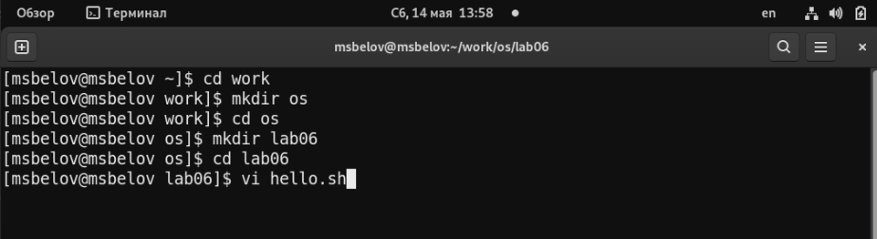
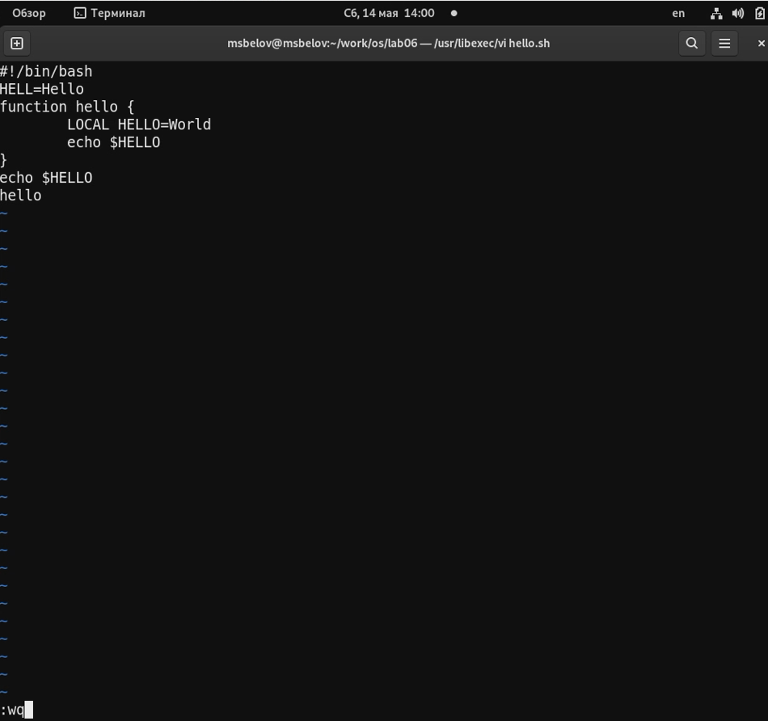
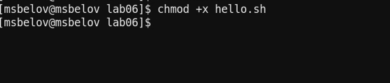
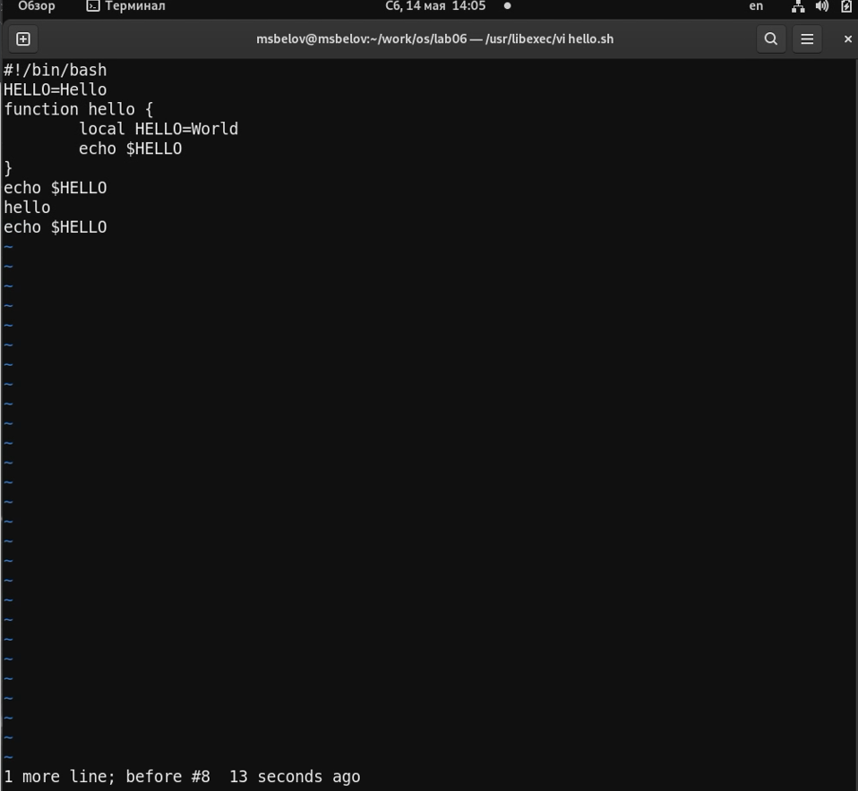
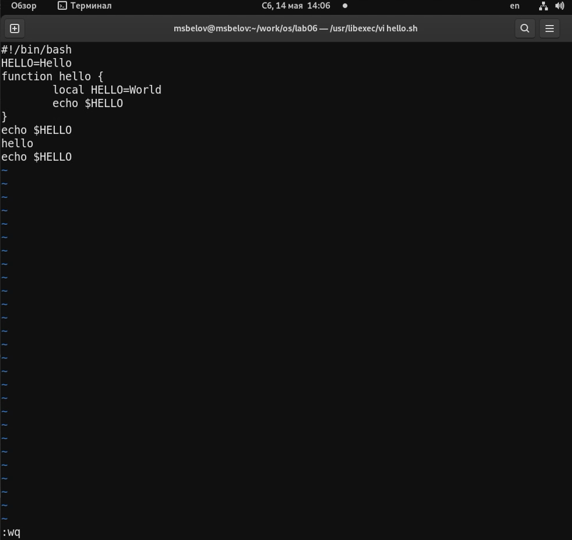

---
## Front matter
lang: ru-RU
title: Лабораторная работа №8
author: |
	Белов Максим Сергеевич - НПИбд-01-21
date: 12.05.2022

## Formatting
toc: false
slide_level: 2
theme: metropolis
header-includes: 
 - \metroset{progressbar=frametitle,sectionpage=progressbar,numbering=fraction}
 - '\makeatletter'
 - '\beamer@ignorenonframefalse'
 - '\makeatother'
aspectratio: 43
section-titles: true
---

# Текстовой редактор vi

## Цель работы:

Познакомиться с операционной системой Linux. Получить практические навыки работы с редактором vi, установленным по умолчанию практически во всех дистрибутивах.

# Выполнение заданий

1. Создадим каталог с именем ~/work/os/lab06. Перейдем во вновь созданный каталог. Вызовем vi и создадим файл hello.sh

##

 2. Введем нужный текст, сохраним и завершим работу с помощью : wq.

##

 3. Сделаем файл исполняемым

##

 4. Отредактируем файл.

##

5. Сохраним и завершим работу

# Выводы

В ходе работы я получил практические навыки работы с редактором vi, установленным по умолчанию практически во всех дистрибутивах.