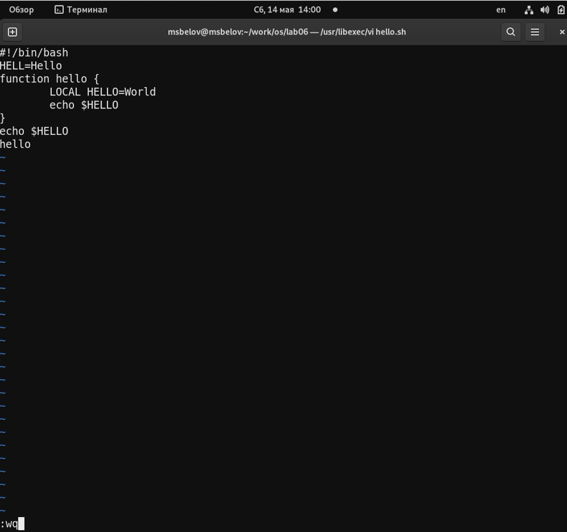
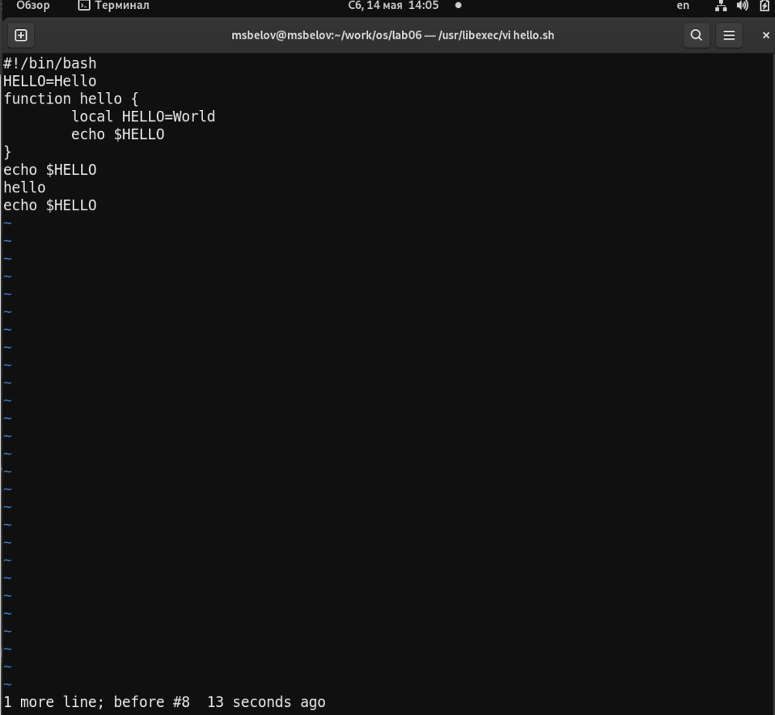

---
## Front matter
title: "Отчет по лабораторной работе №8"
subtitle: "Текстовой редактор vi"
author: "Максим Сергеевич Белов"

## Generic otions
lang: ru-RU
toc-title: "Содержание"

## Bibliography
bibliography: bib/cite.bib
csl: pandoc/csl/gost-r-7-0-5-2008-numeric.csl

## Pdf output format
toc: true # Table of contents
toc-depth: 2
lof: true # List of figures
lot: true # List of tables
fontsize: 12pt
linestretch: 1.5
papersize: a4
documentclass: scrreprt
## I18n polyglossia
polyglossia-lang:
  name: russian
  options:
	- spelling=modern
	- babelshorthands=true
polyglossia-otherlangs:
  name: english
## I18n babel
babel-lang: russian
babel-otherlangs: english
## Fonts
mainfont: PT Serif
romanfont: PT Serif
sansfont: PT Sans
monofont: PT Mono
mainfontoptions: Ligatures=TeX
romanfontoptions: Ligatures=TeX
sansfontoptions: Ligatures=TeX,Scale=MatchLowercase
monofontoptions: Scale=MatchLowercase,Scale=0.9
## Biblatex
biblatex: true
biblio-style: "gost-numeric"
biblatexoptions:
  - parentracker=true
  - backend=biber
  - hyperref=auto
  - language=auto
  - autolang=other*
  - citestyle=gost-numeric
## Pandoc-crossref LaTeX customization
figureTitle: "Рис."
tableTitle: "Таблица"
listingTitle: "Листинг"
lofTitle: "Список иллюстраций"
lolTitle: "Листинги"
## Misc options
indent: true
header-includes:
  - \usepackage{indentfirst}
  - \usepackage{float} # keep figures where there are in the text
  - \floatplacement{figure}{H} # keep figures where there are in the text
---

# Цель работы

Познакомиться с операционной системой Linux. Получить практические навыки работы с редактором vi, установленным по умолчанию практически во всех дистрибутивах.

# Задание

**Задание 1. Создание нового файла с использованием vi:**

1. Создайте каталог с именем ~/work/os/lab06.
2. Перейдите во вновь созданный каталог.
3. Вызовите vi и создайте файл hello.sh
4. Нажмите клавишу i и вводите текст.
5. Нажмите клавишу Esc для перехода в командный режим после завершения ввода
текста.
6. Нажмите : для перехода в режим последней строки и внизу вашего экрана появится приглашение в виде двоеточия.
7. Нажмите w (записать) и q (выйти), а затем нажмите клавишу Enter для сохранения вашего текста и завершения работы.
8. Сделайте файл исполняемым

**Задание 2. Редактирование существующего файла:**

1. Вызовите vi на редактирование файла
2. Установите курсор в конец слова HELL второй строки.
3. Перейдите в режим вставки и замените на HELLO. Нажмите Esc для возврата в командный режим.
4. Установите курсор на четвертую строку и сотрите слово LOCAL.
5. Перейдите в режим вставки и наберите следующий текст: local, нажмите Esc для возврата в командный режим.
6. Установите курсор на последней строке файла. Вставьте после неё строку, содержащую следующий текст: echo $HELLO.
7. Нажмите Esc для перехода в командный режим.
8. Удалите последнюю строку.
9. Введите команду отмены изменений u для отмены последней команды.
10. Введите символ : для перехода в режим последней строки. Запишите произведённые изменения и выйдите из vi.

# Теоретическое введение

В табл. [-@tbl:std-dir] приведено краткое описание команд для работы с редактором vi.

: Описание команд для работы с vi {#tbl:std-dir}

| Команда | Описание                                                                                                           |
|--------------|----------------------------------------------------------------------------------------------------------------------------|
| `G`          | переход в конец файла                                                                               |
| `W`      | перейти на слово вперёд     |
| `o`       | вставить строку под курсором                                           |
| `dw`      | удалить одно слово в буфер.   |
| `dd`      | удалить в буфер одну строку   |
| `u`      | отменить последнее изменение   |
| `cw`      | заменить слово   |
| `:wq`      | записать изменения в файл и выйти из vi   |

# Выполнение лабораторной работы

Создадим каталог с именем ~/work/os/lab06. Перейдем во вновь созданный каталог. Вызовем vi и создадим файл hello.sh
(Рис. [-@fig:001])

{ #fig:001 width=70% }

Нажмем клавишу i и введем текст. Нажмем клавишу Esc для перехода в командный режим после завершения ввода текста. Нажмем : для перехода в режим последней строки. Нажмем w (записать) и q (выйти), а затем нажмем клавишу Enter для сохранения текста и завершения работы.
(Рис. [-@fig:002])

{ #fig:002 width=70% }

Сделаем файл исполняемым
(Рис. [-@fig:003])

{ #fig:003 width=70% }

- Вызовем vi на редактирование файла
- Установим курсор в конец слова HELL второй строки с помощью команды `2 G`(переход на 2ую строку).
- Перейдем в режим вставки и заменим на HELLO с помощью команды `cw`. 
- Установим курсор на четвертую строку с помощью команды `4 G` и сотрем слово LOCAL с помощью команды `dw`.
- Перейдем в режим вставки и наберем следующий текст: local, нажмем Esc для возврата в командный режим.
- Установим курсор на последней строке файла с помощью команды `G`. Вставим после неё строку, содержащую следующий текст: echo $HELLO. (с помощью команды `o`)
- Нажмием Esc для перехода в командный режим.
- Удалим последнюю строку с помощью команды `dd`.
- Введем команду отмены изменений `u` для отмены последней команды
(Рис. [-@fig:004])

{ #fig:004 width=70% }

Завершим работу и сохраним файл с помощью команды `: wq`
(Рис. [-@fig:005])

{ #fig:005 width=70% }

# Выводы

В ходе работы я получил практические навыки работы с редактором vi, установленным по умолчанию практически во всех дистрибутивах.

# Контрольные вопросы

1. Дайте краткую характеристику режимам работы редактора vi.
- командный режим — предназначен для ввода команд редактирования и навигации по редактируемому файлу;
- режим вставки — предназначен для ввода содержания редактируемого файла;
- режим последней (или командной) строки — используется для записи изменений в файл и выхода из редактора.

2. Как выйти из редактора, не сохраняя произведённые изменения?
- Набрать символ :, после него q (или q!), если требуется выйти из редактора без сохранения.

3. Назовите и дайте краткую характеристику командам позиционирования.
- 0 (ноль) — переход в начало строки;
- $ — переход в конец строки;
- G — переход в конец файла;
- n G — переход на строку с номером n.

4. Что для редактора vi является словом?
- Любая последовательность букв
5. Каким образом из любого места редактируемого файла перейти в начало (конец) файла?
- G - переход в конец файла
6. Назовите и дайте краткую характеристику основным группам команд редактирования.

 *Вставка текста*

- а - вставить текст после курсора;
- А - вставить текст в конец строки;
- i - вставить текст перед курсором;
- n i - вставить текст n раз;
- I - вставить текст в начало строки.

*Вставка строки*

- о - вставить строку под курсором;
- О - вставить строку над курсором.

 *Удаление текста*

- x - удалить один символ в буфер;
- d w - удалить одно слово в буфер;
- d $ - удалить в буфер текст от курсора до конца строки;
- d 0 - удалить в буфер текст от начала строки до позиции курсора;
- d d - удалить в буфер одну строку;
- n d d - удалить в буфер n строк.

7. Необходимо заполнить строку символами $. Каковы ваши действия?
- Использую команду c$.
8. Как отменить некорректное действие, связанное с процессом редактирования?
- u - отменить последнее изменение;
9. Назовите и дайте характеристику основным группам команд режима последней строки.
- Kопирование и перемещение текста :n,m d-уничтожить строки с n по m пример: : 3,8d : i,j m k- переместить строки с i по j , начиная со строки k пример : : 4,9m12 : i,j t k- копировать строки с i по j на строку k пример: : 2,5 t 13 : i,j w <имя_файла>- записать строки с i по j в файл с именем <имя_файла> пример: : 5,9 <имя _файла>. Запись в файл и выход из редактора :w- записать измененныйтекст в файл на диске, не выходя из Vi; :w - записать измененный текст в новый файл с именем ; :w! <имя_файла>- записать измененный текст в файл с именем<имя_файла> ; - :wq- записать изменения в файл и выйти из Vi; :q- выйти из редактора Vi; :q!- выйти из редактора без записи; :e!- вернуться в командный режим, отменив все изменения,произведенные со времени последней записи
10. Как определить, не перемещая курсора, позицию, в которой заканчивается строка?
- $ - перемещает курсор в конец строки.
11. Выполните анализ опций редактора vi (сколько их, как узнать их назначение и т.д.).
- Опции редактора Vi позволяют настроить рабочую среду. Для задания опций используется команда set (в режиме последней строки): : set all - вывести полный список опций; : set nu - вывести номера строк; : set list - вывести невидимые символы; : set ic - не учитывать при поиске, является ли символ прописным или строчным.
12. Как определить режим работы редактора vi?
- В командном режиме доступна только навигация и ввод команд редактирования, а в режиме вставки можно редактировать файл.

