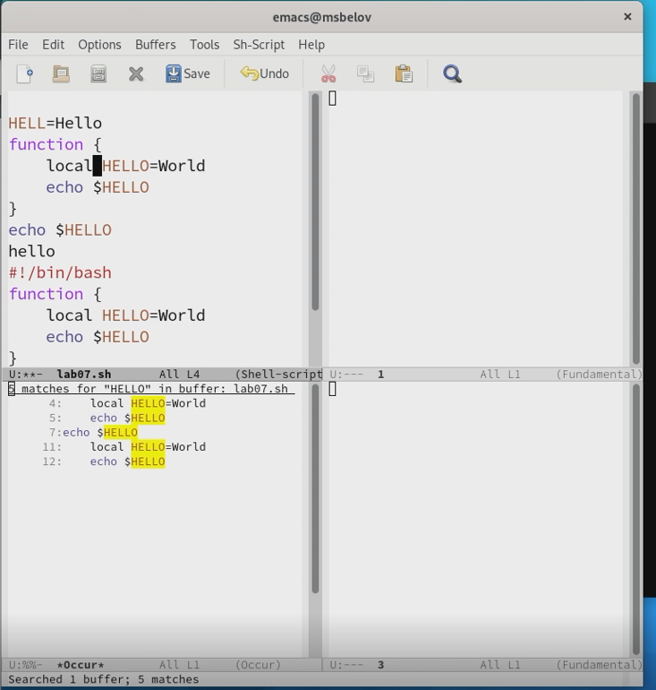

---
## Front matter
lang: ru-RU
title: Лабораторная работа №9
author: |
	Белов Максим Сергеевич - НПИбд-01-21
date: 19.05.2022

## Formatting
toc: false
slide_level: 2
theme: metropolis
header-includes: 
 - \metroset{progressbar=frametitle,sectionpage=progressbar,numbering=fraction}
 - '\makeatletter'
 - '\beamer@ignorenonframefalse'
 - '\makeatother'
aspectratio: 43
section-titles: true
---

# Текстовой редактор emacs

## Цель работы:

Получить практические навыки работы с редактором Emacs.

# Выполнение заданий

1. Откроем emacs, создадим файл lab07.sh и впишем в него текст.

##

 2. Сохраним файл с помощью Ctrl+x Ctrl+s.

##

 3. Проделать с текстом стандартные процедуры редактирования, каждое действие должно осуществляться комбинацией клавиш.

##

 4. Вывести список активных буферов на экран

##

5. Перейдем в другой буфер из списка

##

6. Поделим фрейм на 4 части

##

7. Переключимся в режим поиска

##

8. Поиск и замена слова LOCAL в тексте

##

9. Испробуем другой режим поиска, нажав M-s o.

# Выводы

В ходе работы я познакомился с операционной системой Linux. Получил практические навыки работы с редактором Emacs.