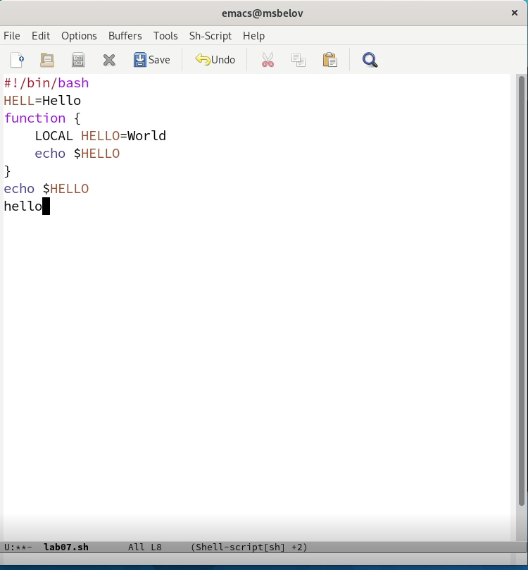
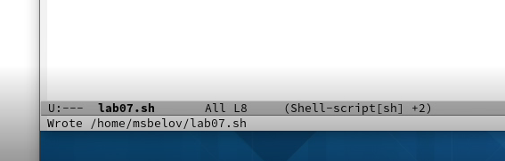
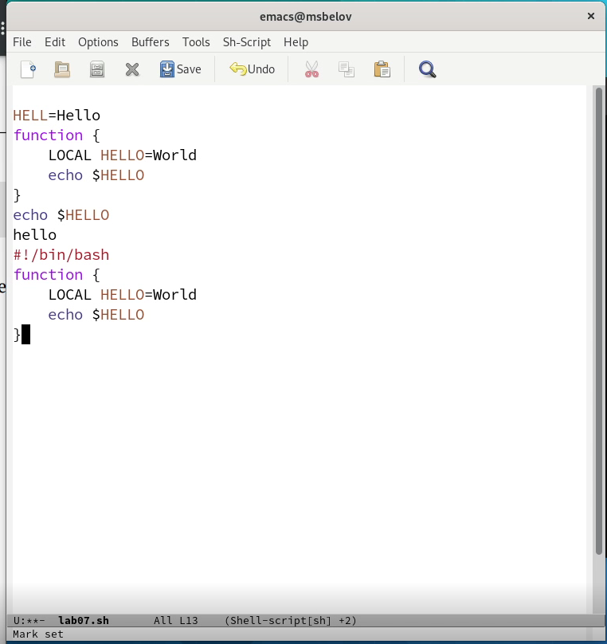
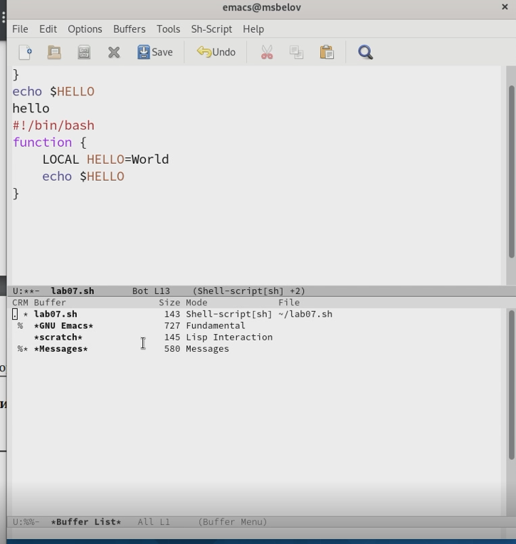
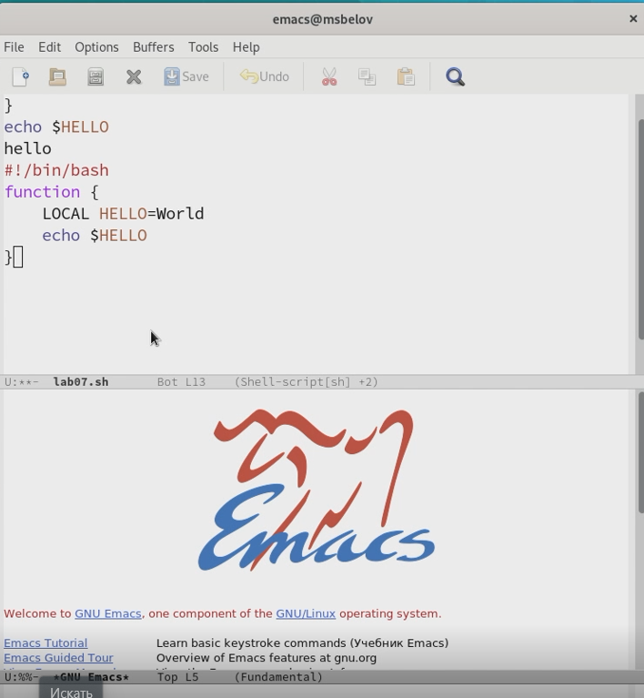
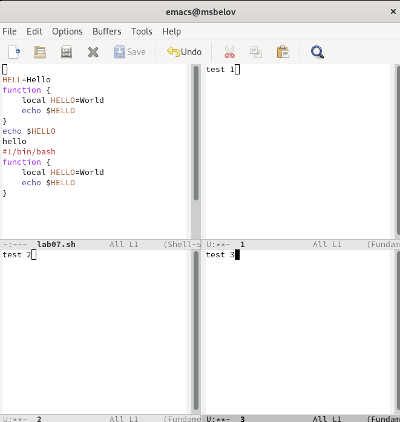
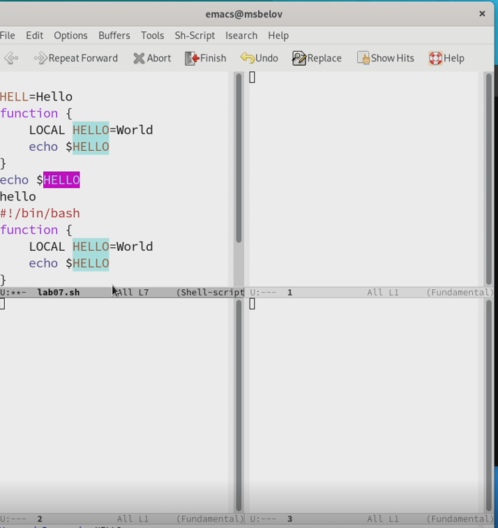
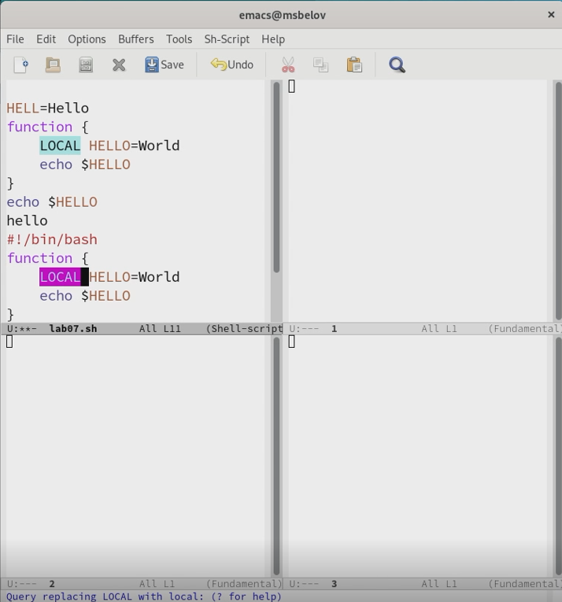
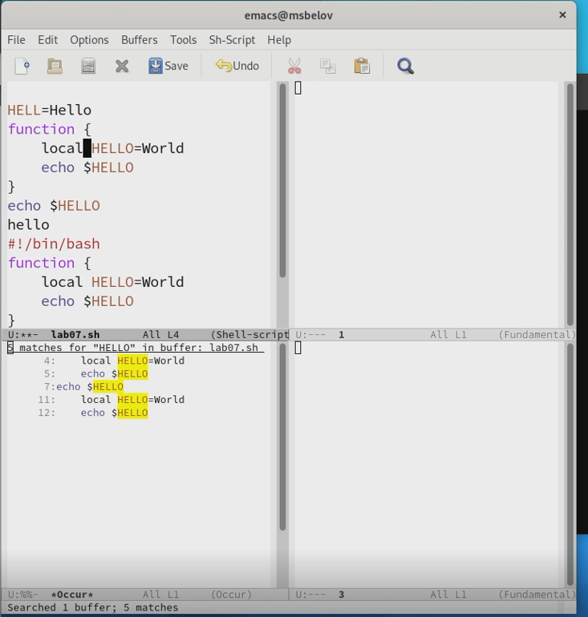

---
## Front matter
title: "Отчет по лабораторной работе №9"
subtitle: "Текстовой редактор emacs"
author: "Максим Сергеевич Белов"

## Generic otions
lang: ru-RU
toc-title: "Содержание"

## Bibliography
bibliography: bib/cite.bib
csl: pandoc/csl/gost-r-7-0-5-2008-numeric.csl

## Pdf output format
toc: true # Table of contents
toc-depth: 2
lof: true # List of figures
lot: true # List of tables
fontsize: 12pt
linestretch: 1.5
papersize: a4
documentclass: scrreprt
## I18n polyglossia
polyglossia-lang:
  name: russian
  options:
	- spelling=modern
	- babelshorthands=true
polyglossia-otherlangs:
  name: english
## I18n babel
babel-lang: russian
babel-otherlangs: english
## Fonts
mainfont: PT Serif
romanfont: PT Serif
sansfont: PT Sans
monofont: PT Mono
mainfontoptions: Ligatures=TeX
romanfontoptions: Ligatures=TeX
sansfontoptions: Ligatures=TeX,Scale=MatchLowercase
monofontoptions: Scale=MatchLowercase,Scale=0.9
## Biblatex
biblatex: true
biblio-style: "gost-numeric"
biblatexoptions:
  - parentracker=true
  - backend=biber
  - hyperref=auto
  - language=auto
  - autolang=other*
  - citestyle=gost-numeric
## Pandoc-crossref LaTeX customization
figureTitle: "Рис."
tableTitle: "Таблица"
listingTitle: "Листинг"
lofTitle: "Список иллюстраций"
lolTitle: "Листинги"
## Misc options
indent: true
header-includes:
  - \usepackage{indentfirst}
  - \usepackage{float} # keep figures where there are in the text
  - \floatplacement{figure}{H} # keep figures where there are in the text
---

# Цель работы

Познакомиться с операционной системой Linux. Получить практические навыки работы с редактором Emacs.

# Задание

1. Открыть emacs.
2. Создать файл lab07.sh с помощью комбинации Ctrl-x Ctrl-f (C-x C-f).
3. Наберите текст
4. Сохранить файл с помощью комбинации Ctrl-x Ctrl-s (C-x C-s).
5. Проделать с текстом стандартные процедуры редактирования, каждое действие должно осуществляться комбинацией клавиш.
- Вырезать одной командой целую строку (С-k).
- Вставить эту строку в конец файла (C-y).
- Выделить область текста (C-space).
- Скопировать область в буфер обмена (M-w).
- Вставить область в конец файла.
- Вновь выделить эту область и на этот раз вырезать её (C-w).
- Отмените последнее действие (C-/).
6. Научитесь использовать команды по перемещению курсора.
- Переместите курсор в начало строки (C-a).
- Переместите курсор в конец строки (C-e).
- Переместите курсор в начало буфера (M-<).
- Переместите курсор в конец буфера (M->).
7. Управление буферами.
- Вывести список активных буферов на экран (C-x C-b).
- Переместитесь во вновь открытое окно (C-x) o со списком открытых буферов
и переключитесь на другой буфер.
- Закройте это окно (C-x 0).
- Теперь вновь переключайтесь между буферами, но уже без вывода их списка на
экран (C-x b).
8. Управление окнами.
- Поделите фрейм на 4 части: разделите фрейм на два окна по вертикали (C-x 3), а затем каждое из этих окон на две части по горизонтали (C-x 2)
- В каждом из четырёх созданных окон откройте новый буфер (файл) и введите
несколько строк текста.
9. Режим поиска
- Переключитесь в режим поиска (C-s) и найдите несколько слов, присутствующих
в тексте.
- Переключайтесь между результатами поиска, нажимая C-s.
- Выйдите из режима поиска, нажав C-g.
- Перейдите в режим поиска и замены (M-%), введите текст, который следует найти и заменить, нажмите Enter , затем введите текст для замены. После того как будут
подсвечены результаты поиска, нажмите ! для подтверждения замены.
- Испробуйте другой режим поиска, нажав M-s o. Объясните, чем он отличается от обычного режима?

# Теоретическое введение

В табл. [-@tbl:std-dir] приведено краткое описание команд для работы с редактором emacs.

: Описание команд для работы с emacs {#tbl:std-dir}

| Команда | Описание                                                                                                           |
|--------------|----------------------------------------------------------------------------------------------------------------------------|
| `Ctrl+space`          | Начать выделение текста с текущего положения курсора                                                                               |
| `Ctrl+w`      | Удалить выделенную область текста в список удалений     |
| `ALt+w`       | Скопировать выделенную область текста в список удалений                                           |
| `Ctrl+y`      | Вставить текст из списка удалений в текущую позицию курсора   |
| `Ctrl+k`      | удалить целую строку   |
| `Ctrl+/`      | отменить последнее изменение   |

# Выполнение лабораторной работы

Откроем emacs, создадим файл lab07.sh и впишем в него текст.
(Рис. [-@fig:001])

{ #fig:001 width=70% }

Сохраним файл с помощью Ctrl+x Ctrl+s.
(Рис. [-@fig:002])

{ #fig:002 width=70% }

5. Проделать с текстом стандартные процедуры редактирования, каждое действие должно осуществляться комбинацией клавиш.
- Вырезать одной командой целую строку (С-k).
- Вставить эту строку в конец файла (C-y).
- Выделить область текста (C-space).
- Скопировать область в буфер обмена (M-w).
- Вставить область в конец файла.
- Вновь выделить эту область и на этот раз вырезать её (C-w).
- Отмените последнее действие (C-/).
(Рис. [-@fig:003])

{ #fig:003 width=70% }

Вывести список активных буферов на экран (C-x C-b).
(Рис. [-@fig:004])

{ #fig:004 width=70% }

Перейдем в другой буфер из списка
(Рис. [-@fig:005])

{ #fig:005 width=70% }

- Поделите фрейм на 4 части: разделите фрейм на два окна по вертикали (C-x 3), а затем каждое из этих окон на две части по горизонтали (C-x 2)
- В каждом из четырёх созданных окон откройте новый буфер (файл) и введите
несколько строк текста.

(Рис. [-@fig:006])

{ #fig:006 width=70% }

- Переключитесь в режим поиска (C-s) и найдите несколько слов, присутствующих в тексте.
- Переключайтесь между результатами поиска, нажимая C-s
(Рис. [-@fig:007])

{ #fig:007 width=70% }

- Поиск и замена слова LOCAL в тексте 
(Рис. [-@fig:008])

{ #fig:008 width=70% }

Испробуйте другой режим поиска, нажав M-s o. Объясните, чем он отличается от
обычного режима? (Он отличается тем, что выводит список в отдельный буфер)
(Рис. [-@fig:009])

{ #fig:009 width=70% }

# Выводы
В ходе работы я познакомился с операционной системой Linux. Получил практические навыки работы с редактором Emacs.

# Контрольные вопросы

1. Emacs представляет собой мощный экранный редактор текста, написанный на языке высокого уровня Elisp.
2. Большое количество команд
3. Буфер — объект, представляющий какой-либо текст. Окно — прямоугольная область фрейма, отображающая один из буферов.
4. Нельзя т.к в одном окне отображается только один буфер 
5. GNU Emacs, Messages, scratch
6. Ctrl+c+|
7. C-x 2
8. В файле .emacs
9. Удаление предыдущего символа
10. Мне показался удобнее редактор vi, т.к. в нем комбинации клавиш было использовать комфортнее.

