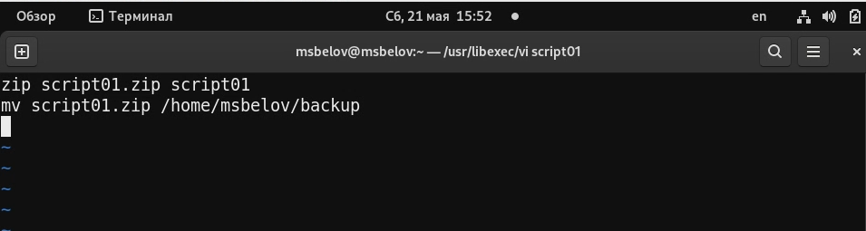
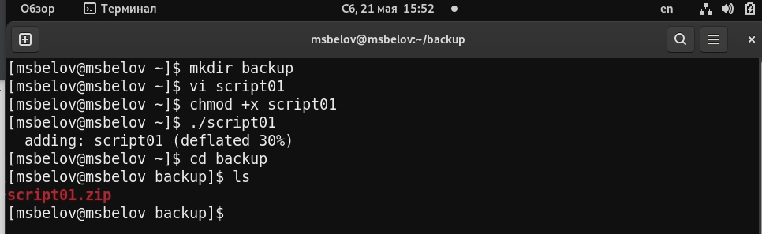
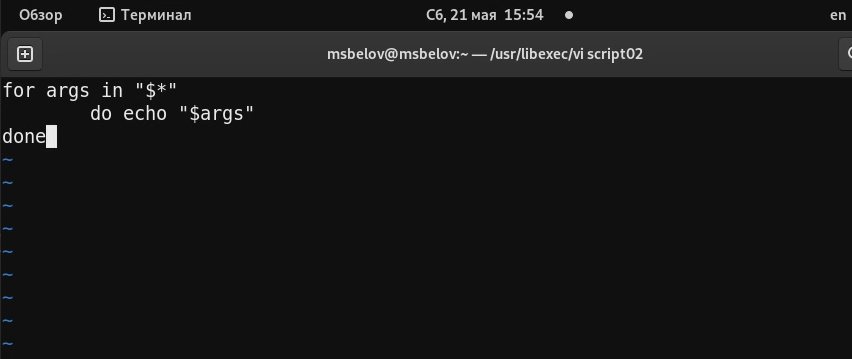
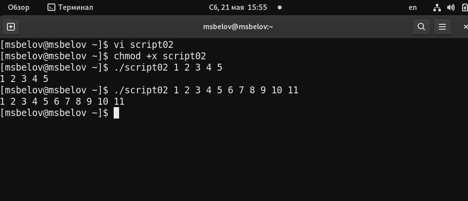
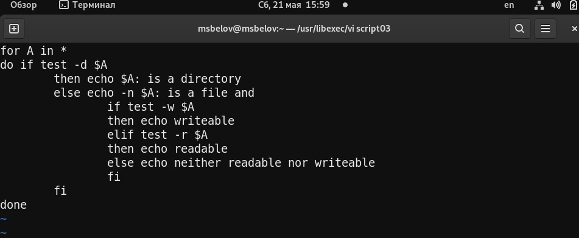
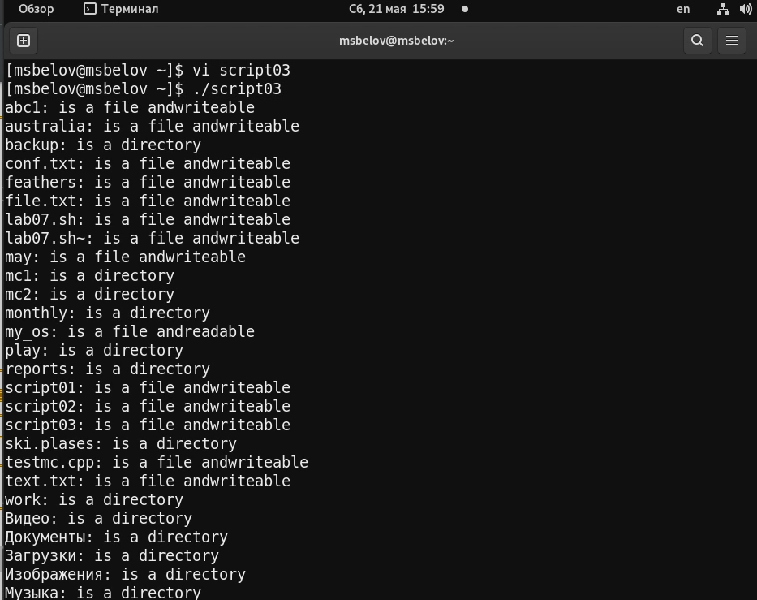
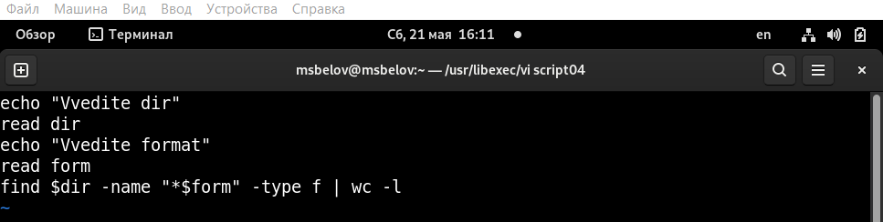
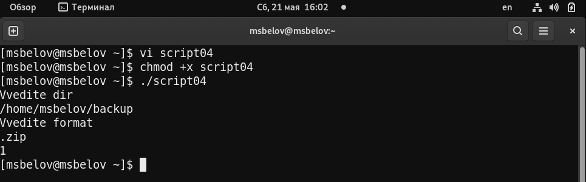

---
## Front matter
lang: ru-RU
title: Лабораторная работа №10
author: |
	Белов Максим Сергеевич - НПИбд-01-21
date: 21.05.2022

## Formatting
toc: false
slide_level: 2
theme: metropolis
header-includes: 
 - \metroset{progressbar=frametitle,sectionpage=progressbar,numbering=fraction}
 - '\makeatletter'
 - '\beamer@ignorenonframefalse'
 - '\makeatother'
aspectratio: 43
section-titles: true
---

# Программирование в командном процессоре ОС UNIX. Командные файлы

## Цель работы:

Изучить основы программирования в оболочке ОС UNIX/Linux. Научиться писать небольшие командные файлы.

# Выполнение заданий

1. Напишем 1-й скрипт 

##

 2. Проверим его

##

 3. Напишем 2-й скрипт

##

 4. Проверим его

##

5. Напишем 3-й скрипт

##

6. Проверим его

##

7. Напишем 4-й скрипт

##

8. Проверим его

# Выводы

В ходе работы я изучил основы программирования в оболочке ОС UNIX/Linux. Научился писать небольшие командные файлы