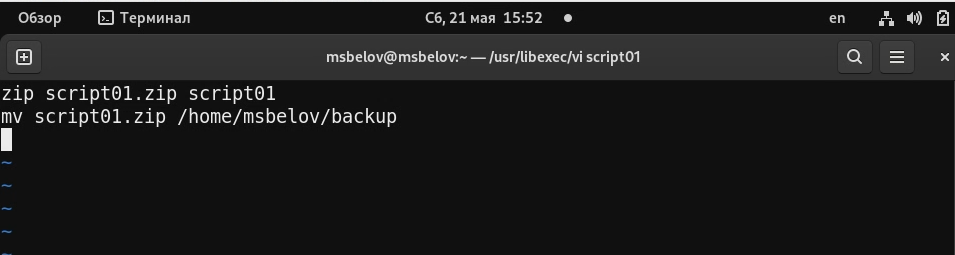
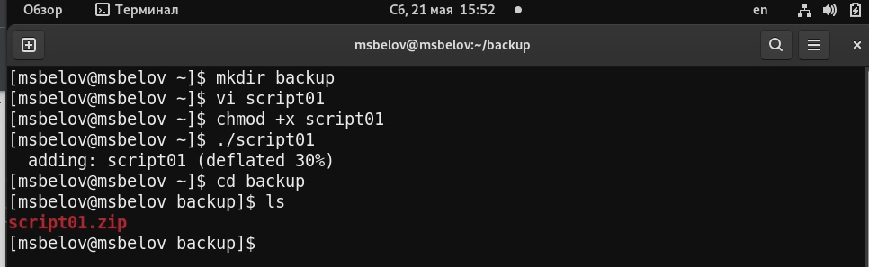
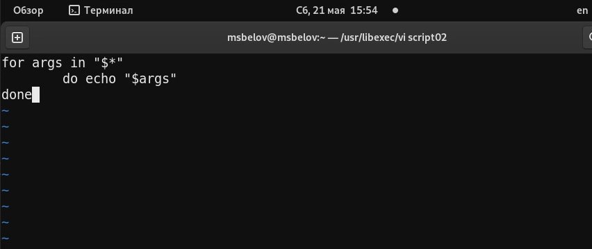
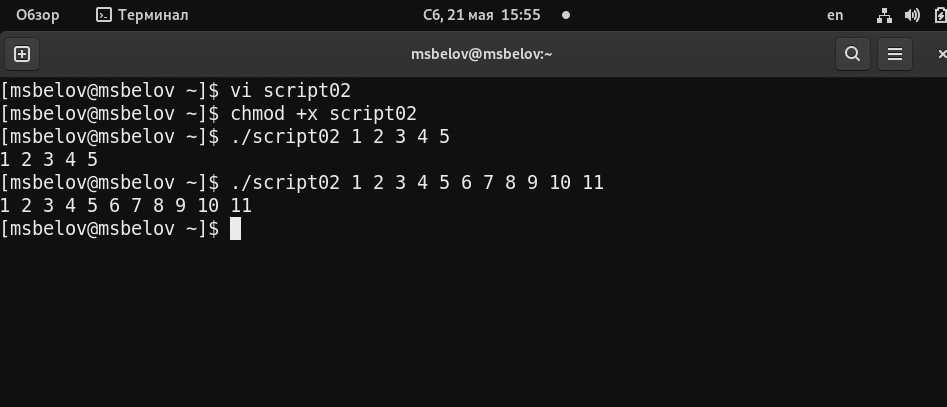
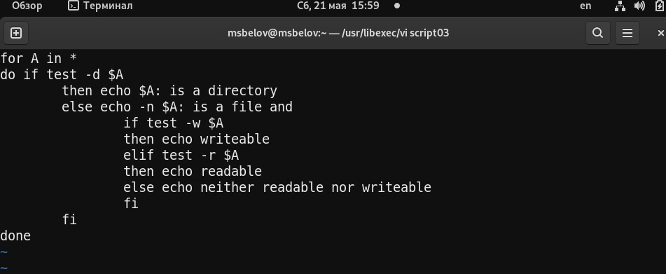
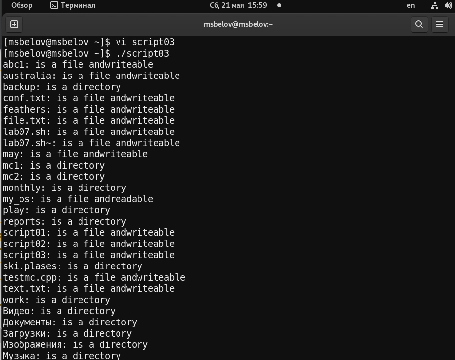
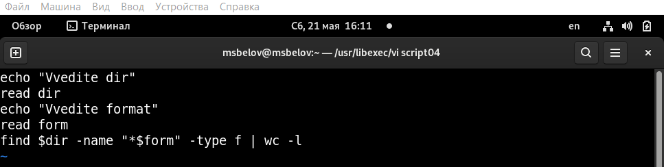
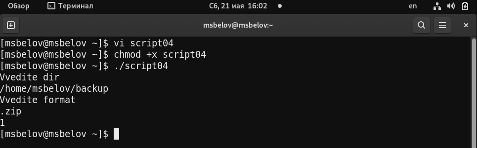

---
## Front matter
title: "Отчет по лабораторной работе №10"
subtitle: "Программирование в командном процессоре ОС UNIX. Командные файлы"
author: "Максим Сергеевич Белов"

## Generic otions
lang: ru-RU
toc-title: "Содержание"

## Bibliography
bibliography: bib/cite.bib
csl: pandoc/csl/gost-r-7-0-5-2008-numeric.csl

## Pdf output format
toc: true # Table of contents
toc-depth: 2
lof: true # List of figures
lot: true # List of tables
fontsize: 12pt
linestretch: 1.5
papersize: a4
documentclass: scrreprt
## I18n polyglossia
polyglossia-lang:
  name: russian
  options:
	- spelling=modern
	- babelshorthands=true
polyglossia-otherlangs:
  name: english
## I18n babel
babel-lang: russian
babel-otherlangs: english
## Fonts
mainfont: PT Serif
romanfont: PT Serif
sansfont: PT Sans
monofont: PT Mono
mainfontoptions: Ligatures=TeX
romanfontoptions: Ligatures=TeX
sansfontoptions: Ligatures=TeX,Scale=MatchLowercase
monofontoptions: Scale=MatchLowercase,Scale=0.9
## Biblatex
biblatex: true
biblio-style: "gost-numeric"
biblatexoptions:
  - parentracker=true
  - backend=biber
  - hyperref=auto
  - language=auto
  - autolang=other*
  - citestyle=gost-numeric
## Pandoc-crossref LaTeX customization
figureTitle: "Рис."
tableTitle: "Таблица"
listingTitle: "Листинг"
lofTitle: "Список иллюстраций"
lolTitle: "Листинги"
## Misc options
indent: true
header-includes:
  - \usepackage{indentfirst}
  - \usepackage{float} # keep figures where there are in the text
  - \floatplacement{figure}{H} # keep figures where there are in the text
---

# Цель работы

Изучить основы программирования в оболочке ОС UNIX/Linux. Научиться писать небольшие командные файлы.

# Задание

1. Написать скрипт, который при запуске будет делать резервную копию самого себя (то есть файла, в котором содержится его исходный код) в другую директорию backup в вашем домашнем каталоге. При этом файл должен архивироваться одним из архиваторов на выбор zip, bzip2 или tar. Способ использования команд архивации необходимо узнать, изучив справку.
2. Написать пример командного файла, обрабатывающего любое произвольное число аргументов командной строки, в том числе превышающее десять. Например, скрипт может последовательно распечатывать значения всех переданных аргументов.
3. Написать командный файл — аналог команды ls (без использования самой этой команды и команды dir). Требуется, чтобы он выдавал информацию о нужном каталоге и выводил информацию о возможностях доступа к файлам этого каталога.
4. Написать командный файл, который получает в качестве аргумента командной строки формат файла (.txt, .doc, .jpg, .pdf и т.д.) и вычисляет количество таких файлов в указанной директории. Путь к директории также передаётся в виде аргумента командной строки.

# Теоретическое введение

В табл. [-@tbl:std-dir] приведено краткое описание команд для работы с командными файлами.

: Описание команд для работы с командными файлами {#tbl:std-dir}

| Команда | Описание                                                                                                           |
|--------------|----------------------------------------------------------------------------------------------------------------------------|
| `getopts`          | Осуществляет синтаксический анализ командной строки, выделяя флаги, и используетсядля объявления переменных.                                                                               |
| `test`      | Единственная функция этой команды заключается в выработке кода завершения     |

# Выполнение лабораторной работы

1. Напишем скрипт, который при запуске будет делать резервную копию самого себя (то есть файла, в котором содержится его исходный код) в другую директорию backup в вашем домашнем каталоге. При этом файл должен архивироваться одним из архиваторов на выбор zip, bzip2 или tar. 
(Рис. [-@fig:001])

{ #fig:001 width=70% }

Сделаем файл script01 исполняемым и проверим его работу
(Рис. [-@fig:002])

{ #fig:002 width=70% }

2. Написать пример командного файла, обрабатывающего любое произвольное число аргументов командной строки, в том числе превышающее десять. Например, скрипт может последовательно распечатывать значения всех переданных аргументов.
(Рис. [-@fig:003])

{ #fig:003 width=70% }

Сделаем файл исполняемым и проверим его работу
(Рис. [-@fig:004])

{ #fig:004 width=70% }

3. Написать командный файл — аналог команды ls (без использования самой этой команды и команды dir). Требуется, чтобы он выдавал информацию о нужном каталоге и выводил информацию о возможностях доступа к файлам этого каталога.
(Рис. [-@fig:005])

{ #fig:005 width=70% }

Сделаем script03 исполняемым и проверим его работу

(Рис. [-@fig:006])

{ #fig:006 width=70% }

4. Написать командный файл, который получает в качестве аргумента командной строки формат файла (.txt, .doc, .jpg, .pdf и т.д.) и вычисляет количество таких файлов в указанной директории. Путь к директории также передаётся в виде аргумента командной строки
(Рис. [-@fig:007])

{ #fig:007 width=70% }

Сделаем script04 исполняемым и проверим его работу
(Рис. [-@fig:008])

{ #fig:008 width=70% }

# Выводы
В ходе работы я изучил основы программирования в оболочке ОС UNIX/Linux. Научился писать небольшие командные файлы.

# Контрольные вопросы

1. Объясните понятие командной оболочки. Приведите примеры командных оболочек. Чем они отличаются?

Командный процессор (командная оболочка, интерпретатор команд shell) — это программа, позволяющая пользователю взаимодействовать с операционной системой
компьютера. В операционных системах типа UNIX/Linux наиболее часто используются
следующие реализации командных оболочек:
- оболочка Борна (Bourne shell или sh) — стандартная командная оболочка UNIX/Linux,
содержащая базовый, но при этом полный набор функций;
- С-оболочка (или csh) — надстройка на оболочкой Борна, использующая С-подобный
синтаксис команд с возможностью сохранения истории выполнения команд;
- оболочка Корна (или ksh) — напоминает оболочку С, но операторы управления программой совместимы с операторами оболочки Борна;
- BASH — сокращение от Bourne Again Shell (опять оболочка Борна), в основе своей совмещает свойства оболочек С и Корна (разработка компании Free Software Foundation).

2. Что такое POSIX?

POSIX (Portable Operating System Interface for Computer Environments) — набор стандартов описания интерфейсов взаимодействия операционной системы и прикладных программ.
Стандарты POSIX разработаны комитетом IEEE (Institute of Electrical and Electronics
Engineers) для обеспечения совместимости различных UNIX/Linux-подобных операционных систем и переносимости прикладных программ на уровне исходного кода.
POSIX-совместимые оболочки разработаны на базе оболочки Корна.

3. Как определяются переменные и массивы в языке программирования bash?

Командный процессор bash обеспечивает возможность использования переменных
типа строка символов. Имена переменных могут быть выбраны пользователем. Пользователь имеет возможность присвоить переменной значение некоторой строки символов. Значение, присвоенное некоторой переменной, может быть впоследствии использовано. Для этого в соответствующем месте командной строки должно быть употреблено имя этой переменной, которому предшествует метасимвол $.

4. Каково назначение операторов let и read?

Команда let является показателем того, что последующие аргументы представляют собой выражение, подлежащее вычислению.

Команда read позволяет считывать значения, введенные с клавиатуры.

5. Какие арифметические операции можно применять в языке программирования bash?

Простейшими математическими выражениями являются сложение (+), вычитание (-), умножение (*), целочисленное деление (/) и целочисленный остаток от деления (%).

6. Что означает операция (( ))?

Для облегчения программирования можно записывать условия оболочки bash в двойные
скобки — (( )).

7. Какие стандартные имена переменных Вам известны?

- HOME — имя домашнего каталога пользователя. Если команда cd вводится без аргументов, то происходит переход в каталог, указанный в этой переменной.
- IFS — последовательность символов, являющихся разделителями в командной строке,
например, пробел, табуляция и перевод строки (new line).
- MAIL — командный процессор каждый раз перед выводом на экран промптера проверяет содержимое файла, имя которого указано в этой переменной, и если содержимое
этого файла изменилось с момента последнего ввода из него, то перед тем как вывести
на терминал промптер, командный процессор выводит на терминал сообщение You
have mail (у Вас есть почта).
- TERM — тип используемого терминала.
- LOGNAME — содержит регистрационное имя пользователя, которое устанавливается
автоматически при входе в систему.

8. Что такое метасимволы?

Такие символы, как ' < > * ? | \ " &, являются метасимволами и имеют для командного процессора специальный смысл. Снятие специального смысла с метасимвола
называется экранированием метасимвола. 

9. Как экранировать метасимволы?

Экранирование может быть осуществлено с помощью предшествующего метасимволу символа \, который, в свою очередь, является метасимволом. Для экранирования группы метасимволов нужно заключить её в одинарные кавычки. Строка, заключённая в двойные кавычки, экранирует все метасимволы, кроме $, ' , \, ". Например,
- echo \* выведет на экран символ *,
- echo ab’*\|*’cd выведет на экран строку ab*\|*cd.

10. Как создавать и запускать командные файлы?

Сначала нужно воспользоваться любым редактором и записать в файл какой-либо код, затем сделать этот файл исполняемым командой chmod +x <имя файла>. После чего запустить его командой ./<имя файла>.

11. Как определяются функции в языке программирования bash?

Группу команд можно объединить в функцию. Для этого существует ключевое слово
function, после которого следует имя функции и список команд, заключённых в фигурные скобки. 

12. Каким образом можно выяснить, является файл каталогом или обычным файлом?

Задать условие:

`if <имя файла> -d`

13. Каково назначение команд set, typeset и unset?

Значение всех переменных можно просмотреть с помощью команды set.

Удалить функцию можно с помощью команды unset c флагом -f.

Команда typeset имеет четыре опции для работы с функциями:
- -f — перечисляет определённые на текущий момент функции;
- -ft — при последующем вызове функции инициирует её трассировку;
- -fx — экспортирует все перечисленные функции в любые дочерние программы оболочек;
- -fu — обозначает указанные функции как автоматически загружаемые. Автоматически загружаемые функции хранятся в командных файлах, а при их вызове оболочка
просматривает переменную FPATH, отыскивая файл с одноимёнными именами функций, загружает его и вызывает эти функции.

14. Как передаются параметры в командные файлы?

При вызове командного файла на выполнение параметры ему могут быть переданы
точно таким же образом, как и выполняемой программе. С точки зрения командного
файла эти параметры являются позиционными. Символ $ является метасимволом командного процессора. Он используется, в частности, для ссылки на параметры, точнее, для получения их значений в командном файле. В командный файл можно передать до девяти параметров. При использовании где-либо в командном файле комбинации символов $i, где 0 < i < 10, вместо неё будет осуществлена подстановка значения параметра с порядковым номером i, т.е. аргумента командного файла с порядковым номером i. Использование комбинации символов $0 приводит к подстановке вместо неё имени данного командного файла.

15. Назовите специальные переменные языка bash и их назначение.

- `$*` — отображается вся командная строка или параметры оболочки;
- `$?` — код завершения последней выполненной команды;
- `$$` — уникальный идентификатор процесса, в рамках которого выполняется командный процессор;
- `$!` — номер процесса, в рамках которого выполняется последняя вызванная на выполнение в командном режиме команда;
- `$-` — значение флагов командного процессора;
- `${#*}` — возвращает целое число — количество слов, которые были результатом $*;
- `${#name}` — возвращает целое значение длины строки в переменной name;
- `${name[n]}` — обращение к n-му элементу массива;
- `${name[*]}` — перечисляет все элементы массива, разделённые пробелом;
- `${name[@]}` — то же самое, но позволяет учитывать символы пробелы в самих переменных;
- `${name:-value}` — если значение переменной name не определено, то оно будет заменено на указанное value;
- `${name:value} — проверяется факт существования переменной;
- `${name=value}` — если name не определено, то ему присваивается значение value;
- `${name?value}` — останавливает выполнение, если имя переменной не определено, и выводит value как сообщение об ошибке;
- `${name+value}` — это выражение работает противоположно ${name-value}. Если переменная определена, то подставляется value;
- `${name#pattern}` — представляет значение переменной name с удалённым самым
коротким левым образцом (pattern);
- `${#name[*]}` и `${#name[@]}` — эти выражения возвращают количество элементов в массиве name.

