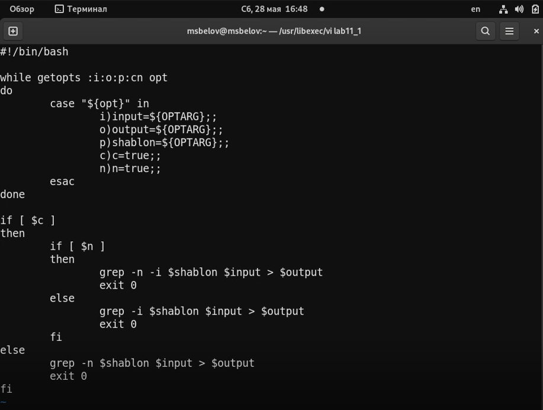
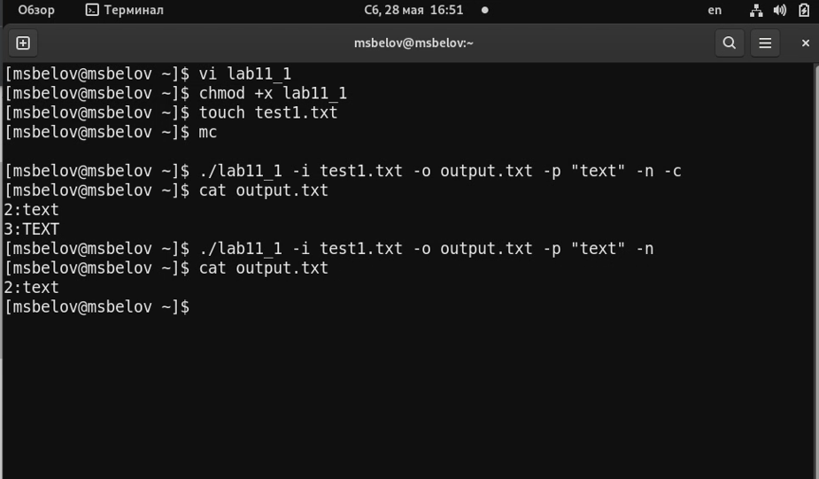
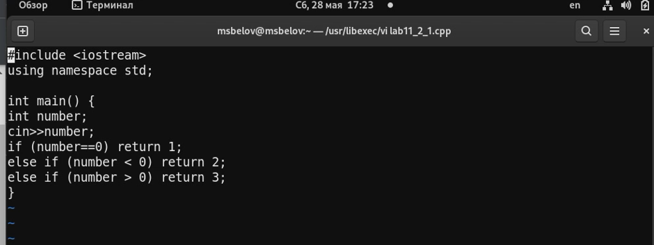
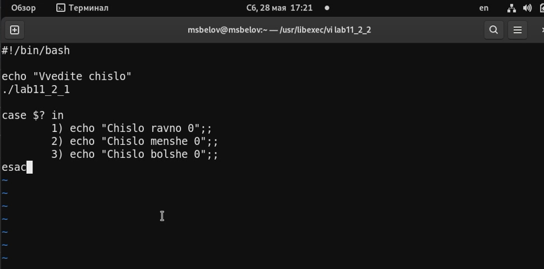
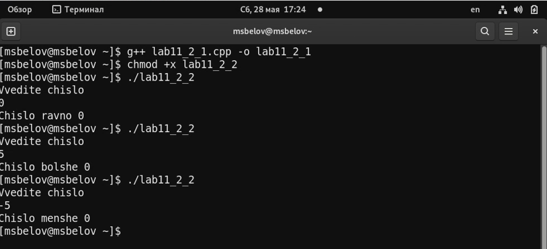
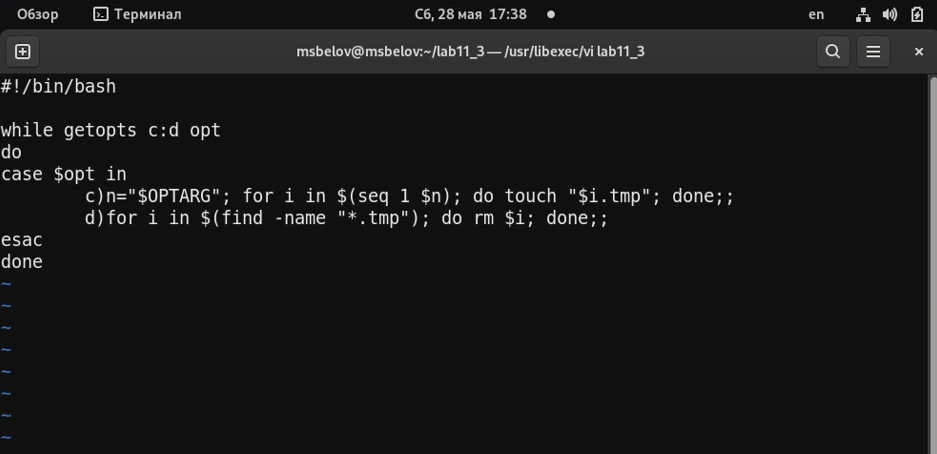
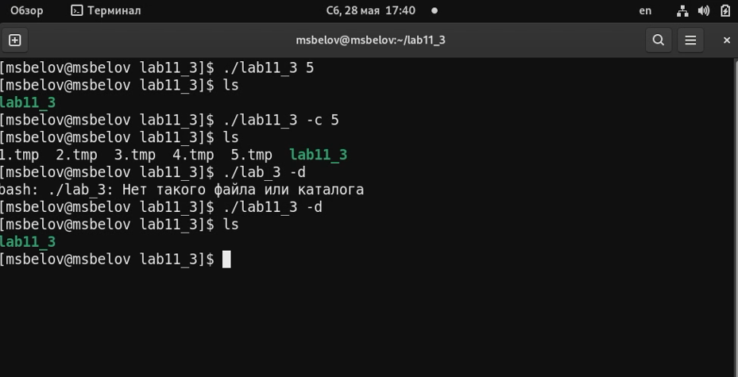
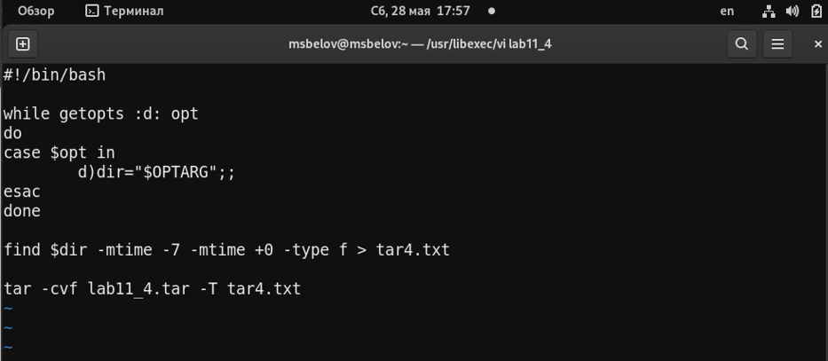
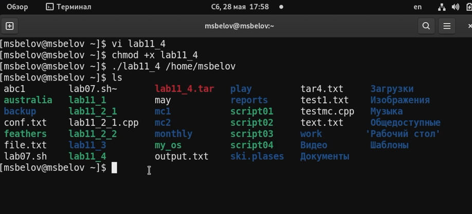

---
## Front matter
lang: ru-RU
title: Лабораторная работа №11
author: |
	Белов Максим Сергеевич - НПИбд-01-21
date: 28.05.2022

## Formatting
toc: false
slide_level: 2
theme: metropolis
header-includes: 
 - \metroset{progressbar=frametitle,sectionpage=progressbar,numbering=fraction}
 - '\makeatletter'
 - '\beamer@ignorenonframefalse'
 - '\makeatother'
aspectratio: 43
section-titles: true
---

# Программирование в командном процессоре ОС UNIX. Ветвления и цикл

## Цель работы:

Изучить основы программирования в оболочке ОС UNIX. Научится писать более
сложные командные файлы с использованием логических управляющих конструкций
и циклов.

# Выполнение заданий

1. Напишем 1-й скрипт 

##

 Проверим его

##

 2. Напишем программу на C++

##

Напишем командный файл

##

Проверим работу командного файла

##

3. Напишем 3-й скрипт

##

Проверим его

##

4. Напишем 4-й скрипт

##

Проверим его

# Выводы

В ходе работы я изучил основы программирования в оболочке ОС UNIX. Научился писать более сложные командные файлы с использованием логических управляющих конструкций и циклов.