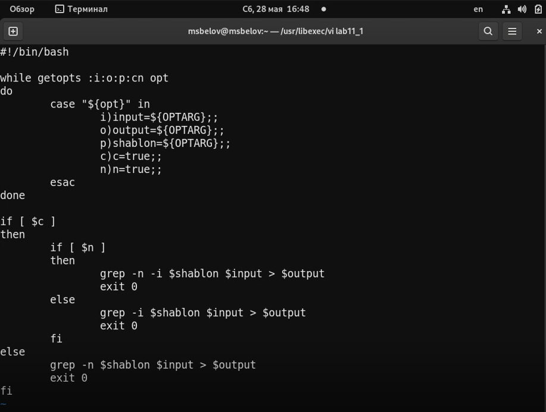
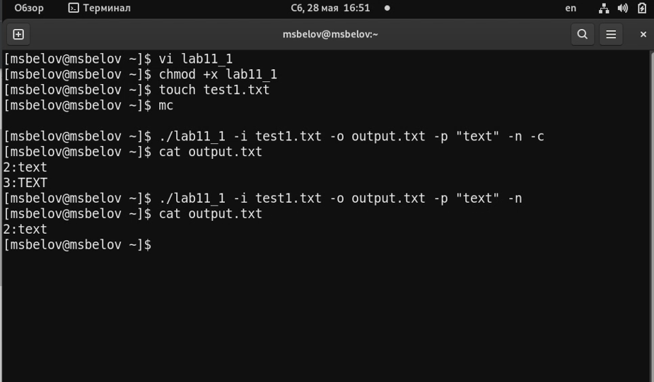
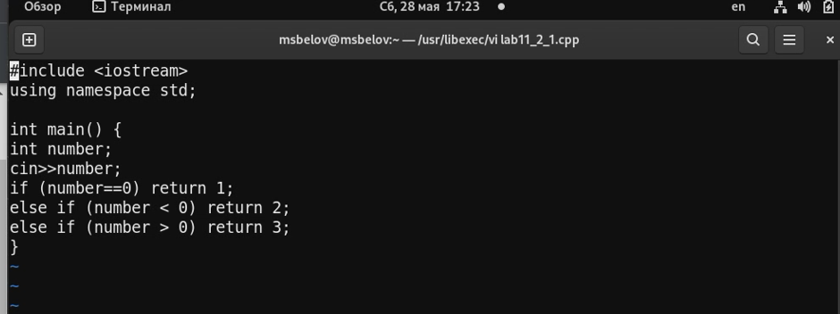
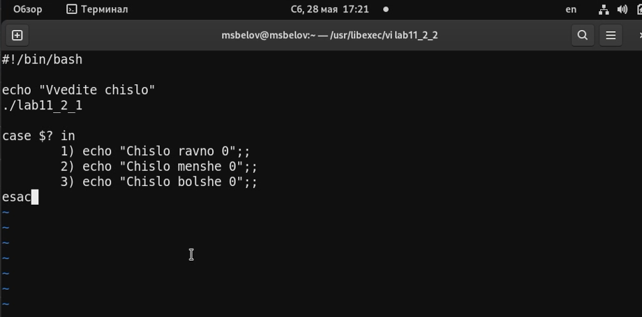
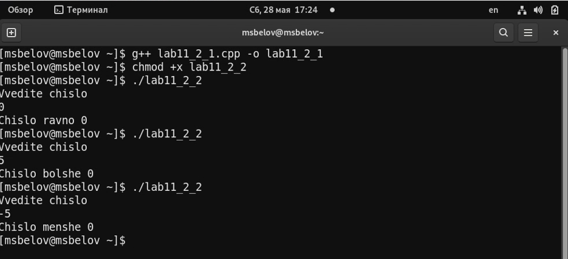
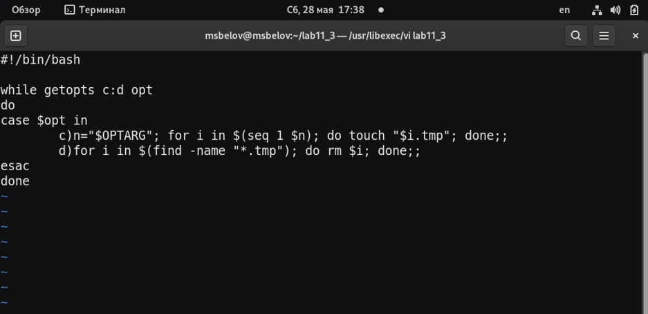
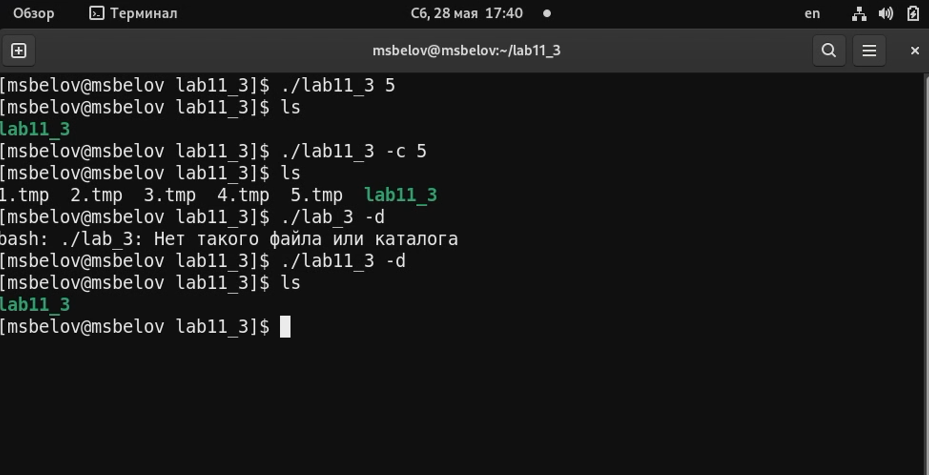
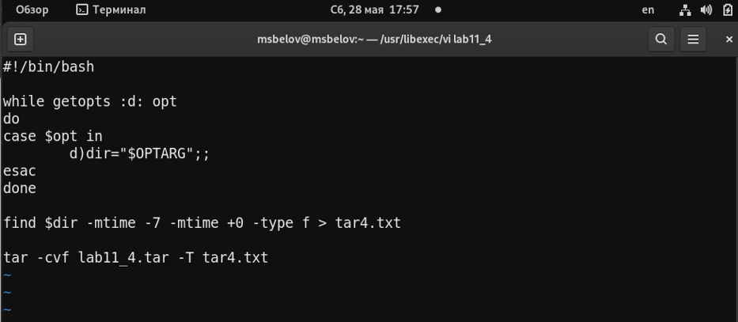
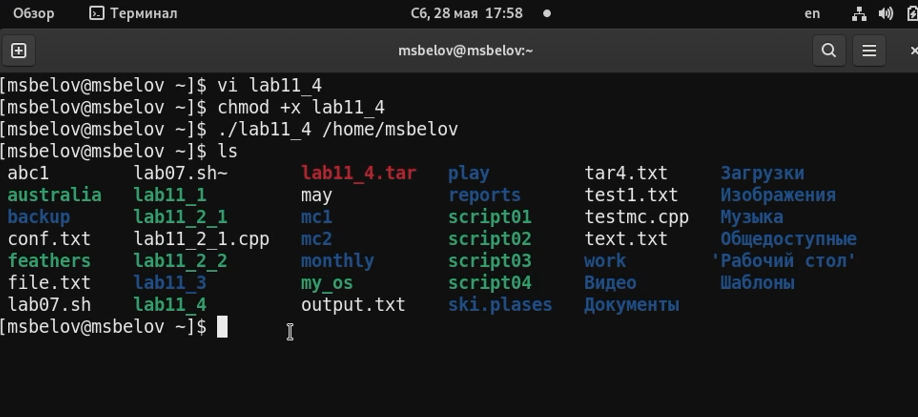

---
## Front matter
title: "Отчет по лабораторной работе №11"
subtitle: "Программирование в командном процессоре ОС UNIX. Ветвления и циклы"
author: "Максим Сергеевич Белов"

## Generic otions
lang: ru-RU
toc-title: "Содержание"

## Bibliography
bibliography: bib/cite.bib
csl: pandoc/csl/gost-r-7-0-5-2008-numeric.csl

## Pdf output format
toc: true # Table of contents
toc-depth: 2
lof: true # List of figures
lot: true # List of tables
fontsize: 12pt
linestretch: 1.5
papersize: a4
documentclass: scrreprt
## I18n polyglossia
polyglossia-lang:
  name: russian
  options:
	- spelling=modern
	- babelshorthands=true
polyglossia-otherlangs:
  name: english
## I18n babel
babel-lang: russian
babel-otherlangs: english
## Fonts
mainfont: PT Serif
romanfont: PT Serif
sansfont: PT Sans
monofont: PT Mono
mainfontoptions: Ligatures=TeX
romanfontoptions: Ligatures=TeX
sansfontoptions: Ligatures=TeX,Scale=MatchLowercase
monofontoptions: Scale=MatchLowercase,Scale=0.9
## Biblatex
biblatex: true
biblio-style: "gost-numeric"
biblatexoptions:
  - parentracker=true
  - backend=biber
  - hyperref=auto
  - language=auto
  - autolang=other*
  - citestyle=gost-numeric
## Pandoc-crossref LaTeX customization
figureTitle: "Рис."
tableTitle: "Таблица"
listingTitle: "Листинг"
lofTitle: "Список иллюстраций"
lolTitle: "Листинги"
## Misc options
indent: true
header-includes:
  - \usepackage{indentfirst}
  - \usepackage{float} # keep figures where there are in the text
  - \floatplacement{figure}{H} # keep figures where there are in the text
---

# Цель работы

Изучить основы программирования в оболочке ОС UNIX. Научится писать более
сложные командные файлы с использованием логических управляющих конструкций
и циклов.

# Задание

1. Используя команды getopts grep, написать командный файл, который анализирует командную строку с ключами:
- -i inputfile - прочитать данные из указанного файла;
- -o outputfile - вывести данные в указанный файл;
- -p шаблон - указать шаблон для поиска;
- -C - различать большие и малые буквы;
- -n - выдавать номера строк.
а затем ищет в указанном файле нужные строки, определяемые ключом -p.
2. Написать на языке Си программу, которая вводит число и определяет, является ли оно больше нуля, меньше нуля или равно нулю. Затем программа завершается с помощью функции exit(n), передавая информацию в о коде завершения в оболочку. Командный файл должен вызывать эту программу и, проанализировав с помощью команды $?, выдать сообщение о том, какое число было введено.
3. Написать командный файл, создающий указанное число файлов, пронумерованных
последовательно от 1 до N (например 1.tmp, 2.tmp, 3.tmp,4.tmp и т.д.). Число файлов, которые необходимо создать, передаётся в аргументы командной строки. Этот же командный файл должен уметь удалять все созданные им файлы (если они существуют).
4. Написать командный файл, который с помощью команды tar запаковывает в архив все файлы в указанной директории. Модифицировать его так, чтобы запаковывались только те файлы, которые были изменены менее недели тому назад (использовать
команду find).

# Теоретическое введение

В табл. [-@tbl:std-dir] приведено краткое описание команд для работы с командными файлами.

: Описание команд для работы с командными файлами {#tbl:std-dir}

| Команда | Описание                                                                                                           |
|--------------|----------------------------------------------------------------------------------------------------------------------------|
| `getopts`          | Осуществляет синтаксический анализ командной строки, выделяя флаги, и используетсядля объявления переменных.                                                                               |

# Выполнение лабораторной работы

1. Скрипт 1
(Рис. [-@fig:001])

{ #fig:001 width=70% }

Сделаем файл исполняемым и проверим его работу
(Рис. [-@fig:002])

{ #fig:002 width=70% }

2. Программа 2.1 (C++)
(Рис. [-@fig:003])

{ #fig:003 width=70% }

Командный файл 2.2
(Рис. [-@fig:004])

{ #fig:004 width=70% }

Проверка работы командного файла
(Рис. [-@fig:005])

{ #fig:005 width=70% }

3. Скрипт 3
(Рис. [-@fig:006])

{ #fig:006 width=70% }

Сделаем файл исполняемым и проверим его работу

(Рис. [-@fig:007])

{ #fig:007 width=70% }

4. Скрипт 4
(Рис. [-@fig:008])

{ #fig:008 width=70% }

Сделаем файл исполняемым и проверим его работу
(Рис. [-@fig:009])

{ #fig:009 width=70% }

# Выводы
В ходе работы я изучил основы программирования в оболочке ОС UNIX. Научился писать более сложные командные файлы с использованием логических управляющих конструкций и циклов.

# Контрольные вопросы

1. Осуществляет синтаксический анализ командной строки, выделяя флаги, и используется для объявления переменных.

2. При перечислении имен файлов текущего каталога можно использовать некторые символы.

3. for, case, if, while

4. break

5. true,: - всегда возвращает 0 в качестве кода выхода. false - всегда возвращает 1 в качестве кода выхода.

6. Введенная строка означает условие существования файла man$s/$i.$s

7. Если речь идет о 2-х параллельных действиях, то это while. когда мы показываем, что сначала делается 1-е действие. потом оно заканчивается при наступлении 2-го действия, применяем until.