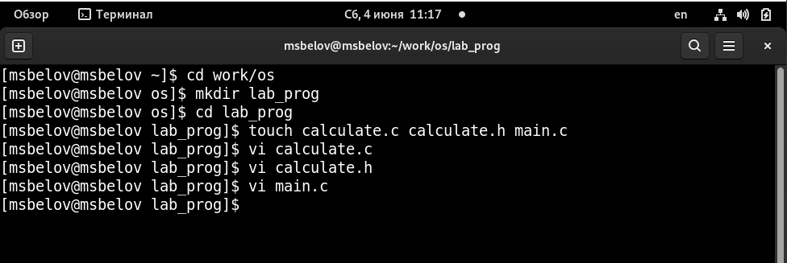

---
## Front matter
lang: ru-RU
title: Лабораторная работа №13
author: |
	Белов Максим Сергеевич - НПИбд-01-21
date: 04.06.2022

## Formatting
toc: false
slide_level: 2
theme: metropolis
header-includes: 
 - \metroset{progressbar=frametitle,sectionpage=progressbar,numbering=fraction}
 - '\makeatletter'
 - '\beamer@ignorenonframefalse'
 - '\makeatother'
aspectratio: 43
section-titles: true
---

# Средства, применяемые при разработке программного обеспечения в ОС типа UNIX/Linux

## Цель работы:

Приобрести простейшие навыки разработки, анализа, тестирования и отладки приложений в ОС типа UNIX/Linux на примере создания на языке программирования С калькулятора с простейшими функциями.

# Выполнение заданий

1. Создадим каталог и в нем нужные нам файлы

##

 2. Создадим Makefile для автоматической компиляции программы

##

 3. Выполним отладку программы calcul. Запусти программу с помощью run

##

 4. Протестируем команду list

##

5. Поставим точку останова на 21 строке в calculate.c

##

6. splint calculate.c

6. splint main.c

# Выводы

В ходе работы я приобрел простейшие навыки разработки, анализа, тестирования и отладки приложений в ОС типа UNIX/Linux на примере создания на языке программирования С калькулятора с простейшими функциями.