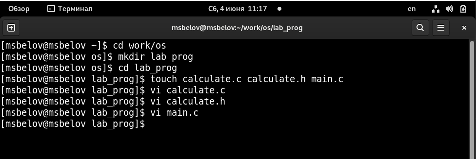
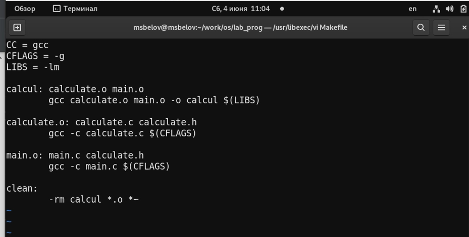
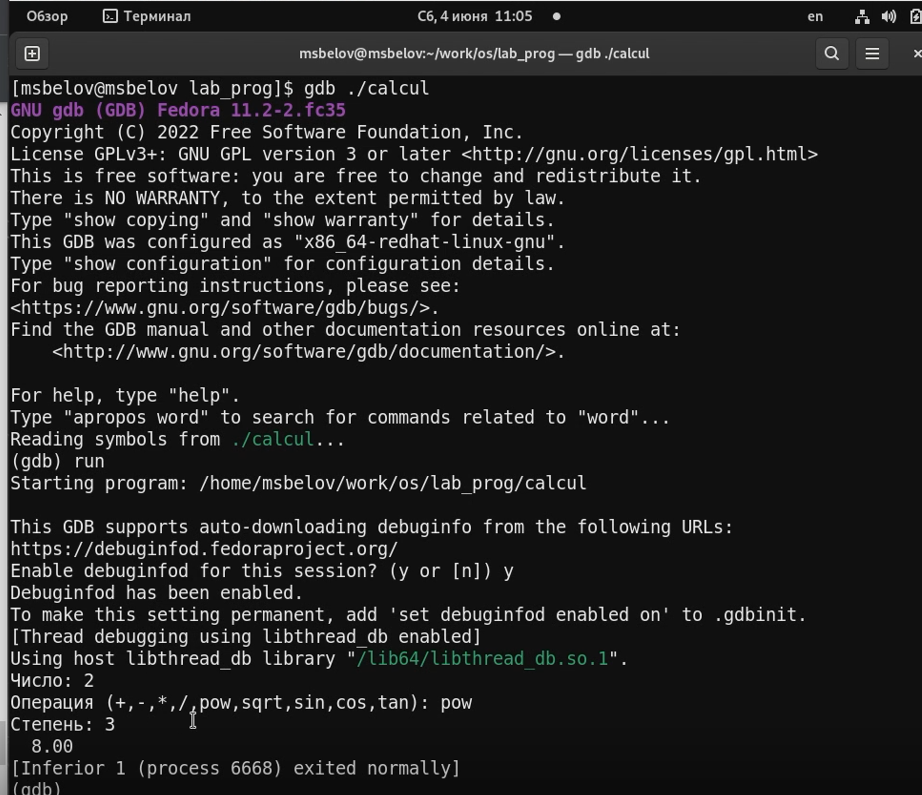
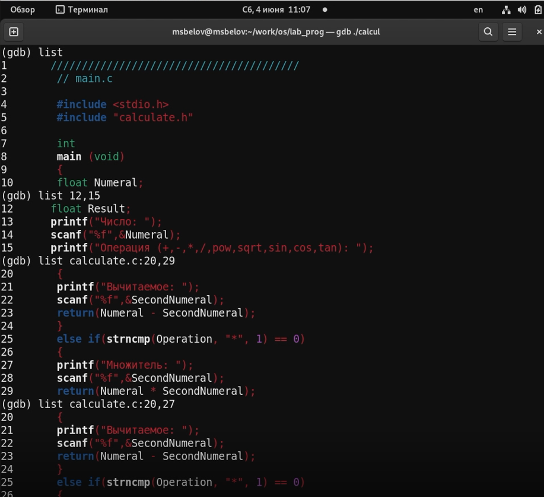
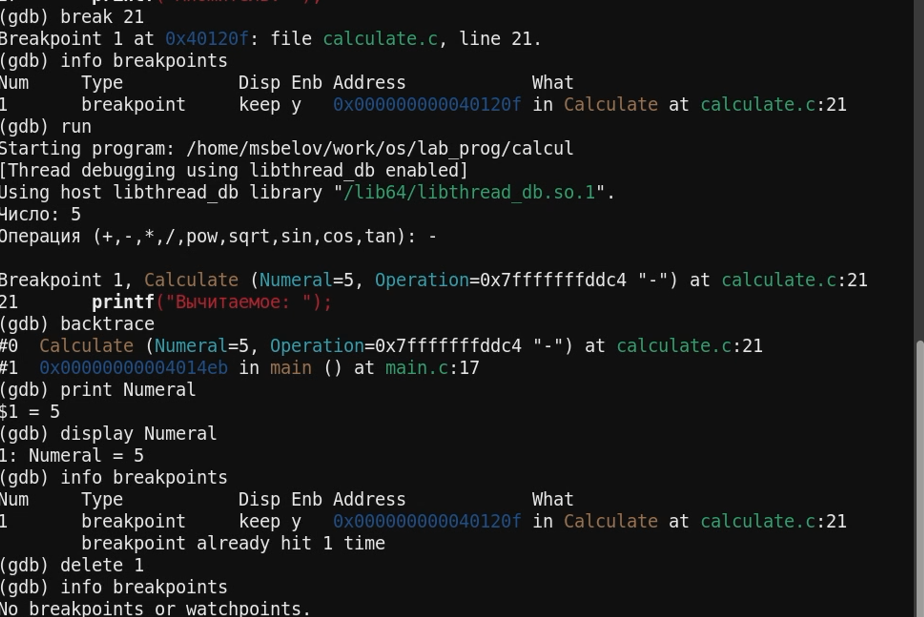
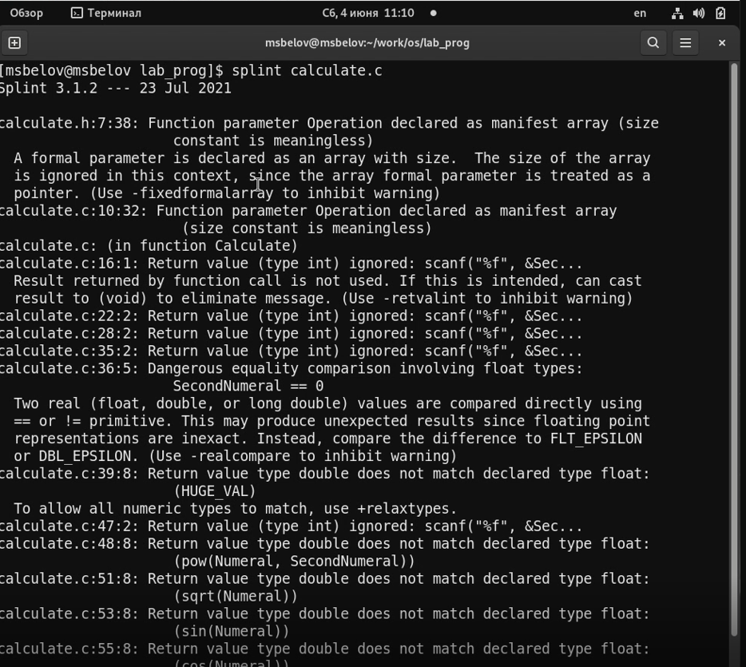
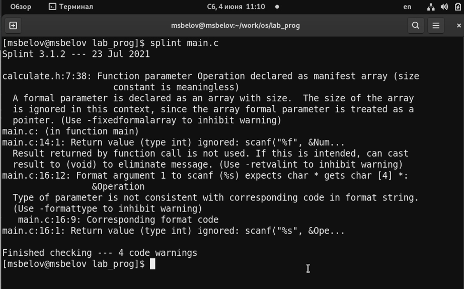

---
## Front matter
title: "Отчет по лабораторной работе №13"
subtitle: "Средства, применяемые при разработке программного обеспечения в ОС типа UNIX/Linux"
author: "Максим Сергеевич Белов"

## Generic otions
lang: ru-RU
toc-title: "Содержание"

## Bibliography
bibliography: bib/cite.bib
csl: pandoc/csl/gost-r-7-0-5-2008-numeric.csl

## Pdf output format
toc: true # Table of contents
toc-depth: 2
lof: true # List of figures
lot: true # List of tables
fontsize: 12pt
linestretch: 1.5
papersize: a4
documentclass: scrreprt
## I18n polyglossia
polyglossia-lang:
  name: russian
  options:
	- spelling=modern
	- babelshorthands=true
polyglossia-otherlangs:
  name: english
## I18n babel
babel-lang: russian
babel-otherlangs: english
## Fonts
mainfont: PT Serif
romanfont: PT Serif
sansfont: PT Sans
monofont: PT Mono
mainfontoptions: Ligatures=TeX
romanfontoptions: Ligatures=TeX
sansfontoptions: Ligatures=TeX,Scale=MatchLowercase
monofontoptions: Scale=MatchLowercase,Scale=0.9
## Biblatex
biblatex: true
biblio-style: "gost-numeric"
biblatexoptions:
  - parentracker=true
  - backend=biber
  - hyperref=auto
  - language=auto
  - autolang=other*
  - citestyle=gost-numeric
## Pandoc-crossref LaTeX customization
figureTitle: "Рис."
tableTitle: "Таблица"
listingTitle: "Листинг"
lofTitle: "Список иллюстраций"
lolTitle: "Листинги"
## Misc options
indent: true
header-includes:
  - \usepackage{indentfirst}
  - \usepackage{float} # keep figures where there are in the text
  - \floatplacement{figure}{H} # keep figures where there are in the text
---

# Цель работы

Приобрести простейшие навыки разработки, анализа, тестирования и отладки приложений в ОС типа UNIX/Linux на примере создания на языке программирования С калькулятора с простейшими функциями.

# Задание

1. В домашнем каталоге создайте подкаталог ~/work/os/lab_prog.
2. Создайте в нём файлы: calculate.h, calculate.c, main.c.
Это будет примитивнейший калькулятор, способный складывать, вычитать, умножать
и делить, возводить число в степень, брать квадратный корень, вычислять sin, cos, tan.
При запуске он будет запрашивать первое число, операцию, второе число. После этого
программа выведет результат и остановится.
3. Выполните компиляцию программы посредством gcc
4. При необходимости исправьте синтаксические ошибки.
5. Создайте Makefile
6. С помощью gdb выполните отладку программы calcul
исправьте Makefile)
7. С помощью утилиты splint попробуйте проанализировать коды файлов calculate.c и main.c.

# Теоретическое введение

В табл. [-@tbl:std-dir] приведено краткое описание команд gdb.

: Описание команд gdb {#tbl:std-dir}

| Команда | Описание                                                                                                           |
|--------------|----------------------------------------------------------------------------------------------------------------------------|
| `backtrace`          | вывод на экран пути к текущей точке останова (по сути вывод названий всех функций)                                                                               |
| `break`          | установить точку останова (в качестве параметра может быть указан номер строки или название функции)                                                                                |
| `info breakpoints`          |  вывести на экран список используемых точек останова                                                                                |
| `list`          | увывести на экран исходный код (в качестве параметра может быть указано название файла и через двоеточие номера начальной и конечной строк)                                                                                |

# Выполнение лабораторной работы

1. В домашнем каталоге создайте подкаталог ~/work/os/lab_prog.
 Создайте в нём файлы: calculate.h, calculate.c, main.c.
(Рис. [-@fig:001])

{ #fig:001 width=70% }

2. Создадим Makefile и отредактируем его. В этом Makefile в начале задаются параметры в виде названия компилятора и флагов конфигурации к нему(библиотеки). В целом, с помощью этого Makefile мы можем компилировать программу автоматически.
(Рис. [-@fig:002])

{ #fig:002 width=70% }

3. С помощью gdb выполните отладку программы calcul. Также запустим программу внутри отладчика с помощью run.
(Рис. [-@fig:003])

{ #fig:003 width=70% }

Протестируем команды list для вывода строк из файлов.
(Рис. [-@fig:004])

{ #fig:004 width=70% }

 Установим точку останова в calculate.c на 21 строке и затем уберем ее.
(Рис. [-@fig:005])

{ #fig:005 width=70% }

4. С помощью утилиты splint попробуйте проанализировать коды файлов calculate.c и main.c.

calculate.c
(Рис. [-@fig:006])

{ #fig:006 width=70% }

main.c
(Рис. [-@fig:007])

{ #fig:007 width=70% }

# Выводы
В ходе работы я приобрел простейшие навыки разработки, анализа, тестирования и отладки приложений в ОС типа UNIX/Linux на примере создания на языке программирования С калькулятора с простейшими функциями.

