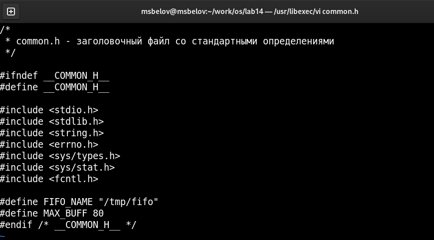
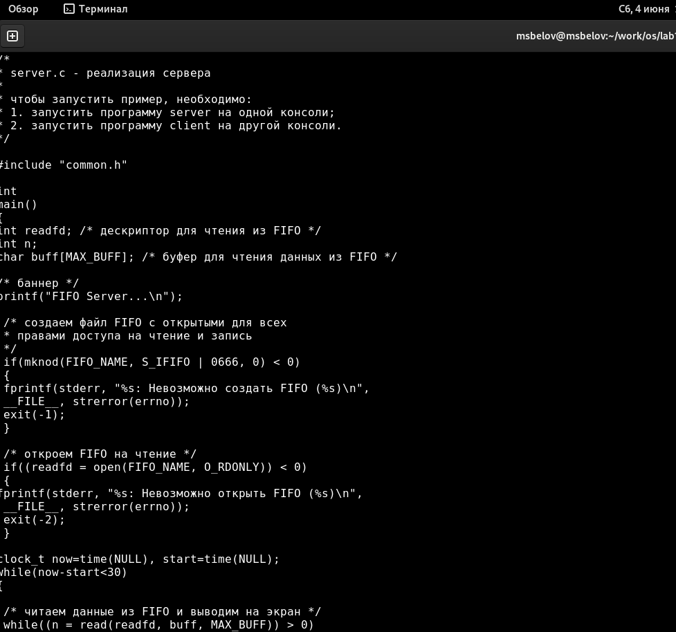
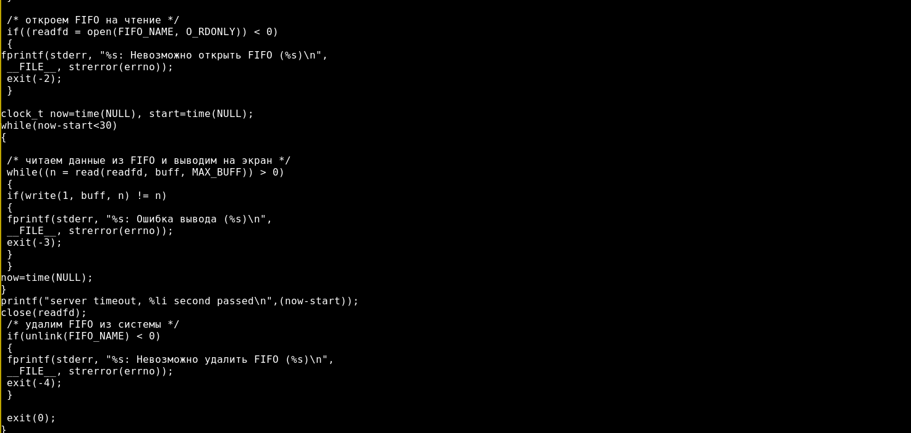
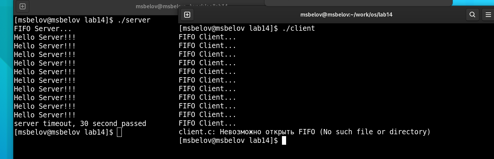

---
## Front matter
lang: ru-RU
title: Лабораторная работа №14
author: |
	Белов Максим Сергеевич - НПИбд-01-21
date: 04.06.2022

## Formatting
toc: false
slide_level: 2
theme: metropolis
header-includes: 
 - \metroset{progressbar=frametitle,sectionpage=progressbar,numbering=fraction}
 - '\makeatletter'
 - '\beamer@ignorenonframefalse'
 - '\makeatother'
aspectratio: 43
section-titles: true
---

# Именованные каналы

## Цель работы:

Приобретение практических навыков работы с именованными каналами.

# Выполнение заданий

1. Файл common.h

##

 2. Файл server.c

##

##

 3. Файл client.c

##

4. Проверка работы

# Выводы

В ходе работы я приобрел практические навыки работы с именованными каналами.